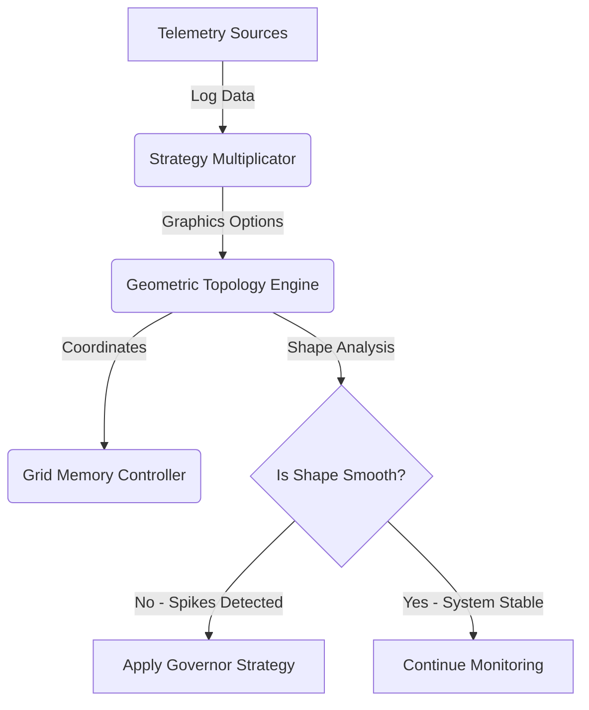

# Geometric Topology Engine: The Shape of Computing
## Synthesis of Geometry, Telemetry, and System Strategy

This module (`geometric_topology_engine.py`) realizes the concept of "Numbers as Geometry". It transforms abstract system telemetry into concrete geometric shapes to analyze and optimize performance.

### The Geometric Metaphor

1.  **The Point (Singularity)**:
    *   **Data Source**: `GraphicsLogParser` (DirectX/Vulkan options).
    *   **Representation**: A 3D coordinate `(Performance, Thermal, Threads)`.
    *   **Action**: Mapped into the `GridMemoryController` as an "Imaginary" value.

2.  **The Vector (Line)**:
    *   **Data Source**: Dependency flow between logs.
    *   **Representation**: A segment connecting two Points.
    *   **Metric**: **Tension**. High difference in load between two points creates "High Tension" (Latency).

3.  **The Polygon (Sector)**:
    *   **Data Source**: Grouped tasks (e.g., all Vulkan compute jobs).
    *   **Representation**: A closed shape formed by vectors.
    *   **Metric**: **Morphology Score**. We calculate the ratio of Area (Throughput) to Perimeter (Complexity).
        *   *High Efficiency*: Compact, circular shapes.
        *   *Low Efficiency*: Spiky, irregular shapes (Bottlenecks).

4.  **The Topology (Final Shape)**:
    *   **Action**: The system analyzes the "Health" of these shapes.
    *   **Correction**: If "High Tension" is detected, the `StrategyMultiplicator` is invoked to "Smooth" the line (e.g., by changing the CPU Governor to `performance` mode).

### Architecture Integration

This engine sits at the top of the stack, orchestrating the underlying modules:



### Usage

```python
from geometric_topology_engine import DataTopologyEngine

# Initialize
engine = DataTopologyEngine()

# 1. Boot Grid Memory
engine.grid_controller.boot_sequence()

# 2. Ingest Data & Build Shapes
points = engine.ingest_telemetry_as_points()
engine.build_dependency_vectors(points)

# 3. Analyze & Optimize
engine.analyze_topology_health()
```
