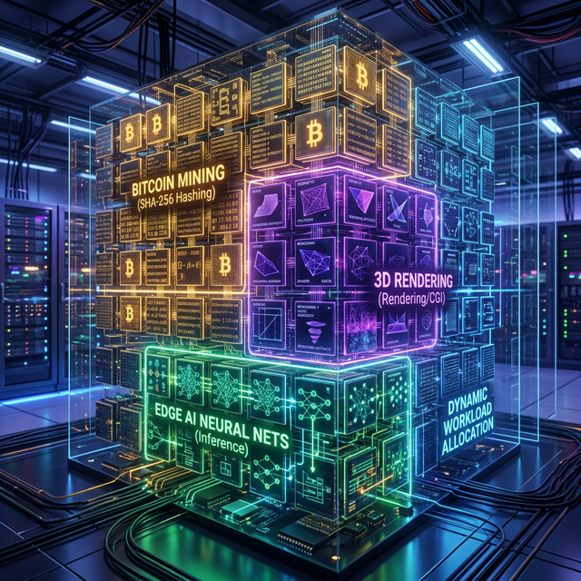

# Krystal-stack-platform-framework 🌌



Welcome to the **Krystal Stack**, a next-generation heterogeneous computational platform. This repository encompasses a groundbreaking approach to Edge AI, Heavy Industrial Automation, and now—**High-Performance Dual-Income GPU Ecosystems**.

Are you a datacenter architect, a cloud-render provider, or a large-scale computational miner? The Krystal Stack bridges the gap between high-level reasoning, big data streaming, and real-time hardware orchestration.

---

## 💎 The Crown Jewel: Krystal Bitboard

The newest and most advanced module in the stack is **[Krystal Bitboard](./krystal-bitboard)**. It transforms idle or single-purpose GPU farms into **Dynamic Dual-Earn Hubs**.

### Why Choose One When You Can Dual-Earn?
Standard miners suffer from latency penalties when switching to rendering jobs or waiting for cloud compute tasks. Krystal Bitboard uses **Zero-Latency Network Bidding** and **Adaptive VRAM Allocation grids**, splitting your GPU seamlessly into isolated, crash-free execution zones:
- **Bitcoin Mining (SHA-256 Vulkan Compute)**
- **Cloud Rendering (Blender Cycles/Octane)**
- **Edge AI Inference (ONNX)**

If rendering commands a higher market price at any second, an **Economic Governor** routes 85% of your VRAM capacity instantly to the render farm without killing your Stratum 10% connection. The math is simple: **Maximize Yield, Zero Downtime**.

### 💼 Commercial-Grade Enterprise Layer


Ready for massive scale? Krystal Stack is packaged with a custom Enterprise layer capable of orchestrating 1,000 to 100,000 GPUs:
- **Centralized Admin (Fleet Command)**: JWT-secured NOC (Network Operations Center) overrides. Instantaneous cluster-wide resource pivoting.
- **Decentralized Admin (Swarm Consensus)**: Peer-to-peer Gossip protocol for Web3 node providers. The cluster auto-heals and negotiates smart-contract payouts via hyper-local consensus.
- **Big Data Data Lake Shippers**: Native telemetry injections into *Kafka*, *Snowflake*, and *AWS Kinesis* for corporate Business Intelligence. Monitor `carbon_offset_metric`, `render_farm_completed_tflops`, and hardware degradation via real-time linear regression trajectories.

👉 **[Discover Krystal Bitboard for Enterprise & Mining Farms](./krystal-bitboard/README_MINERS.md)**

---

## 🧠 Legacy & Core AI Modules

While Krystal Bitboard spearheads the monetization layer, the Krystal Stack originated as an industrial neural architecture.

### 1) Gamesa Cortex V2 (The Neural Control Plane)
An AI stack running on commodity PC hardware to deliver safety-critical performance in industrial automation.
- **Rust for Safety-Critical Planning** 🦀: Real-time pathfinding (A*, RRT) with memory safety.
- **Vulkan for Spatial Awareness** 🌋: Compute Shaders for massive parallel volumetric grid collision detection.
- **Docker & vGPU Framework** 🐳: Slicing the host GPU for containerized workloads securely.
- *Codebase*: `gamesa_cortex_v2/`

### 2) FANUC RISE v3.0 - Cognitive Forge
An advanced CNC Copilot representing the evolution from deterministic execution to probabilistic creation. 
- **Shadow Council Governance**: Three distinct role-playing agents (Creator, Auditor, Accountant) voting on safe AI integration on the factory floor.
- **Probability Canvas**: The "Glass Brain" interface revealing decision trees and future trajectories instead of stagnant status logs.
- *Codebase*: `advanced_cnc_copilot/`

---

## 🛠️ Repository Map

- **`krystal-bitboard/`**: **Dual-Earn Economy Engine**. The bleeding-edge enterprise module for dynamic GPU slicing, crypto-mining, rendering, and big data teleportation.
- **`krystal-ob/`**: Advanced Hardware Telemetry and Overclocking daemon utilizing Linear Regression.
- **`krystal-miner/`**: Proof-of-concept Vulkan-accelerated SHA-256 worker limits.
- **`gamesa_cortex_v2/`**: Core Industrial heterogeneous AI stack (Rust/Vulkan/Python).
- **`advanced_cnc_copilot/`**: FANUC RISE v3.0 Cognitive Forge prototype and interaction patterns.
- **`docs/`**: Technical specs, architectural maps, and historical deployments.

---

## 🌐 Quickstart (Enterprise Datacenter)

Deploying a Krystal ecosystem is containerized for massive scalability utilizing Nvidia MPS (Multi-Process Service):

```bash
git clone https://github.com/RhodosBerger/Krystal-stack-platform-framework
cd Krystal-stack-platform-framework/krystal-bitboard

# Export your corporate NOC Endpoint
export CENTRAL_ADMIN_URL=https://fleet.yourdatacenter.com

# Deploy the complete Big Data & GPU Slicing Stack
docker-compose -f docker-compose.enterprise.yml up -d
```

## Authors & License
**Architect**: Dušan Kopecký
**Email**: dusan.kopecky0101@gmail.com
**License**: Apache 2.0 (See `LICENSE` file)

---

## 🚀 Podporte vývoj Krystal-stacku
Tento projekt je open-source a spolieha na komunitnú podporu:
- **GitHub Sponsors**: [https://github.com/sponsors/RhodosBerger](https://github.com/sponsors/RhodosBerger)
  *(Mesačne 5–50 €, dostanete early access k premium enterprise a AI modulom)*
- **USDT-TRC20 (pre Čínu a Áziu)**: `Txxxxxxxxxxxxxxxxxxxxxxxxxx`

Ďakujem každému, kto pomôže tvoriť budúcnosť decentralizovaného computingu! 🚀
