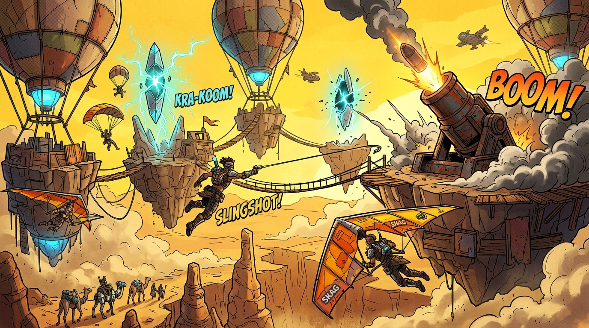

# KRYSTAL-STACK PLATFORM FRAMEWORK 🌌
### Heterogeneous Compute Kernel · Janet DSL · Procedural Godot 4.x · Aerial Balloon Warfare · VorpX VR & Ncon by Korrado · Strict 6 Max HP Invariant

[-22c55e?style=for-the-badge&logo=pytest)](file:///c:/Users/dusan/Documents/GitHub/Krystal-stack-platform-framework/tests/)
[](file:///c:/Users/dusan/Documents/GitHub/Krystal-stack-platform-framework/krystal_janet/)
[](file:///c:/Users/dusan/Documents/GitHub/Krystal-stack-platform-framework/)
[](file:///c:/Users/dusan/Documents/GitHub/Krystal-stack-platform-framework/godot_project/)
[](file:///c:/Users/dusan/Documents/GitHub/Krystal-stack-platform-framework/)
[](file:///c:/Users/dusan/Documents/GitHub/Krystal-stack-platform-framework/krystal_web_hub/static/ncon_vorpx_marketing_studio.html)
[](file:///c:/Users/dusan/Documents/GitHub/Krystal-stack-platform-framework/LICENSE)

---

## 🌟 Prehľad & Nová Charakteristika Softvéru (2026 Next-Gen Edition)

**Krystal-Stack Platform Framework** je modulárny heterogénny výpočtový, simulačný a herný ekosystém. Prepája nízkoúrovňovú akceleráciu hardvéru (**Vulkan Compute Shaders, DirectML NPU offload, OpenVINO inference**) s vysokoexpresívnym funkcionálnym procedurálnym metaprogramovaním (**Janet Lisp AST & DSL Engine**), 3D procedurálnym generovaním herných scén pre **Godot Engine 4.x**, taktickým kartovým RPG systémom s **256 144 kombináciami** a kinetickou fyzikou v štýle **Just Cause** s vizuálnou estetikou **Borderlands** na sýtom žltom podklade (`#facc15`).

Celý systém je zviazaný striktným deterministickým pravidlom – **Vitálnym Invariantom 6 Max HP** (žiadna jednotka, hrdina ani posádka nemôže prekročiť 6 životov), dvojpodvojným ekonomickým účtovníctvom s auditom a aéterickým protokolom Ordinals.



---

## 🧩 Hlavné Architektonické Súčasti, Definície & Manifestácie

### 1. Heterogénne Výpočtové Jadro & Edge Kognitívna Inteligencia
* **Definícia**: Paralelný orchestrátor hardvérových výpočtov vyťažujúci grafické procesory, neurónové koprocesory (NPU) a malé jazykové modely (SLM).
* **Manifestácia**:
  * **Vulkan Compute Pipeline**: Volumetrická detekcia kolízií a raymarching signovaných dištančných polí (SDF).
  * **DirectML / ONNX NPU Offload**: Beží na procesoroch Intel Tiger Lake / Meteor Lake s nízkou spotrebou.
  * **IBM Granite 4B / Edge SLM**: Generovanie taktických dialógov, vyhodnocovanie trhových spreadov a automatická správa zdrojov bez závislosti od cloudu.

### 2. Janet Lisp S-Expression & AST Kompilačný Most
* **Definícia**: Deterministický procedurálny metaprogramovací most, ktorý kompiluje matematické variety a herné pravidlá do AST reprezentácií nezávislých na platforme.
* **Manifestácia**:
  * **20 validovaných Janet DSL súborov** v [`krystal_janet/`](file:///c:/Users/dusan/Documents/GitHub/Krystal-stack-platform-framework/krystal_janet/).
  * Parser S-výrazov a AST validátor [`janet_bridge.py`](file:///c:/Users/dusan/Documents/GitHub/Krystal-stack-platform-framework/krystal_janet/janet_bridge.py) s garanciou vyvážených zátvoriek.
  * Generovanie procedurálneho PEG gramatického vstupu pre antistresovú hernú logiku.

### 3. Taktické Bojové RPG "Posledný Kmeň" & 256k Kombinatorika
* **Definícia**: Komplexný kartový a hexový ťahový systém s astronomickým stavovým priestorom a hlbokou strategickou voľbou.
* **Manifestácia**:
  * **256 144 Kombinačných Stavov ($2^{18}$)**: 512 makro-vetiev $\times$ 512 priestorových trajektórií na hexovej mape.
  * **Mulligan Fáza Výmeny Kariet**: Možnosť strategickej výmeny počiatočnej ruky s prepočtom conduit dosahu.
  * **Striktný Invariant 6 Max HP**: Všetky bytosti, hrdinovia a pevnosti majú škálu $0 \dots 6$ HP. Každý zásah a mitigácia (Húževnatosť vs. chladné zbrane, Reflexy vs. strelné zbrane) je matematicky overená testami.
  * **40 Archetypov & 120 Pomocníkov**: Škálovateľné duely s The West algebrou a GNOME CSD rozhraním.

### 4. Vzdušný Bojový Ekosystém: Balónové Ostrovy, 240mm Mínomet & Rogala
* **Definícia**: Vzdušná taktická vrstva modelujúca aerostatický vztlak, gravitačnú strmú balistiku a akrobatický pohyb.
* **Manifestácia**:
  * **Vznášajúce sa Ostrovy (Aerial Islands)**: Nesené obrími solárno-tepelnými a aéterickými plynovými balónmi ($24\,000\,\text{m}^3$), prepojené visutými lanovými a oceľovými mostami (**Skybridges**).
  * **Pevnostný 240mm Obliehací Mínomet**: Paľba z výšky $280\,\text{m}$ s gravitačným urýchlením granátu až na $263\,\text{m/s}$ a dopadovou kinetickou energiou cez $9\,990\,\text{kJ}$.
  * **Rogalo (Flexibilné Delta-Krídlo)**: Kĺzavosť $7.5 : 1$, využívanie stúpavých termických prúdov a dolet cez $730\,\text{m}$.
  * **Riaditeľné Padáky**: Brzdný odpor ($C_D = 1.45$) s terminálnou bezpečnou rýchlosťou $5.2\,\text{m/s}$.
  * **Just Cause Kinetika**: Vystreľovací hák (navíjanie $24\,\text{m/s}$, slingshot katapult $+16.5\,\text{m/s}$) pre naskakovanie na plávajúce ostrovy.

### 5. VorpX VR & Ncon by Korrado Optika (130° FOV)
* **Definícia**: Stereoskopická 3D injekcia a podpora širokouhlých periférií novej generácie pre plnú imerziu.
* **Manifestácia**:
  * Podpora profilov: **HTC Vive Pro**, **Meta Quest 3**, a ultra-širokouhlý **Ncon by Korrado** ($130^\circ$ FOV, Dual 4K HDR, $144\,\text{Hz}$, Direct-Drive IMU $1.2\,\text{ms}$).
  * Vizuálny štýl **Borderlands**: Žlté pozadie `#facc15`, tušové kontúry hrúbky 3.5px, kvantované tiene a halftone bodky.

### 6. Aéterická Ekonomika, Ordinals & Dvojpodvojné Účtovníctvo
* **Definícia**: Decentralizovaný virtuálny trh so stabilnou konzerváciou zdrojov a digitálnou provenienciou.
* **Manifestácia**:
  * **Aéterický Protokol Ordinals**: Zápis digitálnych artefaktov a generatívnych malieb do nesmrteľnej knihy.
  * **Dvojpodvojný Audit**: Transakcie podliehajú striktnej rovnováhe $\sum \text{Debet} = \sum \text{Kredit}$.
  * **Dražobný Trh Truhlíc & Artefaktov**: Anti-sniping ochrana a escrow viazanie nugetov.

---

## 🎮 Interaktívne Web Štúdiá (Live na porte 8089)

Po spustení servera sú priamo v prehliadači dostupné špecializované riadiace konzoly:

| Štúdio / Modul | URL cesta | Kľúčové Vlastnosti |
|---|---|---|
| **Epické Divadlo Kampane** | [`/static/epic_campaign_theater_studio.html`](http://localhost:8089/static/epic_campaign_theater_studio.html) | 3 kapitoly ságy, generátor misií, živé 2D Canvas divadlo boja, lore kódex |
| **Balónové Ostrovy & Mínomet** | [`/static/aerial_balloons_mortar_studio.html`](http://localhost:8089/static/aerial_balloons_mortar_studio.html) | Balistika 240mm mínometu, kĺzanie rogala 7.5:1, padáky, visuté cesty |
| **Ncon VR & Kinetika Just Cause** | [`/static/ncon_vorpx_marketing_studio.html`](http://localhost:8089/static/ncon_vorpx_marketing_studio.html) | Simulácia ťahu lana, slingshotu, Borderlands shader a predaj Ncon VR |
| **Mulligan & 256k Ťahov** | [`/static/mulligan_cards_studio.html`](http://localhost:8089/static/mulligan_cards_studio.html) | Interaktívna výmena kariet, dosah kryštálových vedení, 6 Max HP |
| **Totemy, Kúzla & Anomálie** | [`/static/totem_anomalies_studio.html`](http://localhost:8089/static/totem_anomalies_studio.html) | Ladenie frekvencie totémov (432Hz), azúrové blesky, trhliny |
| **Metaverzový Trh & Granite LLM** | [`/static/metaverse_market_studio.html`](http://localhost:8089/static/metaverse_market_studio.html) | 4B IBM Granite generovanie ponúk, AMM barter bazár, overenie rozpočtu |
| **Aukcie, Ordinals & Evolučné ML** | [`/static/art_ordinals_and_ml_studio.html`](http://localhost:8089/static/art_ordinals_and_ml_studio.html) | Dražba generatívnych obrazov, nápisy Ordinals, streaming kontrolér |
| **Zodiac, Verdy & Mriežky** | [`/static/zodiac_optics_and_grids.html`](http://localhost:8089/static/zodiac_optics_and_grids.html) | 12 domov zverokruhu, optika priblíženia, mriežky 3x3 až 21:19 |
| **40 Archetypov & 120 Pomocníkov** | [`/static/archetype_helper_matrix.html`](http://localhost:8089/static/archetype_helper_matrix.html) | Roster 20 mužov / 20 žien, The West duely s húževnatosťou a reflexmi |
| **InnoGames Strategické Rozhranie** | [`/static/innogames_kmen.html`](http://localhost:8089/static/innogames_kmen.html) | Stavba budov, ťažba surovín, dobývanie sektorov mapy |
| **Hlavný Mission Control Hub** | [`/static/index.html`](http://localhost:8089/static/index.html) | Centrálna riadiaca matica, telemetria Vulkan/NPU, prepojenie systémov |

---

## 🚀 Rýchle Spustenie (Local Competitive Engine)

Spustenie headless engine servera (Python + Janet AST):

```bash
# Klonovanie repozitára
git clone https://github.com/RhodosBerger/Krystal-stack-platform-framework.git
cd Krystal-stack-platform-framework

# Spustenie kompletného testovacieho balíka (424 testov):
python -m unittest discover tests

# Validácia všetkých 20 Janet DSL skriptov:
python -m krystal_janet.janet_bridge

# Spustenie živého API a Web Hub servera na porte 8089:
python -m krystal_web_hub.krystal_engine_core 8089
```

Navštívte v prehliadači: **`http://localhost:8089/static/index.html`**

---

## 💎 VÝZVA NA PODPORU / DONATE PRE ĎALŠIU VERZIU (2026/2027)

Vývoj Krystal-Stacku smeruje k masívnemu rozšíreniu: **natívnemu multiplayeru, plnému Raymarching renderovaniu cez Vulkan 1.3, hlbokej podpore neurónových koprocesorov NPU v reálnom čase a priamej VorpX integrácii pre headsety Ncon by Korrado**.

Aby sme mohli dokončiť ďalšiu veľkú verziu a zabezpečiť prevádzku vysokovýkonných dedikovaných herných a výpočtových nodov, vyhlasujeme **oficiálnu výzvu na komunitnú a firemnú podporu**.

### 🎁 Čo získa každý podporovateľ (Donor & Sponsor Tier)?

Každý podporovateľ, ktorý prispeje na rozvoj ďalšej verzie, získa:

1. 🔑 **Plnú Komerčnú / VIP Licenciu na 1 ROK (1-Year Enterprise Commercial License)**:
   * Neobmedzené komerčné použitie celého frameworku pre vlastné hry, aplikácie a VR projekty.
   * Právo na bezplatný upgrade na všetky vydané minoritné aj majoritné verzie počas celého roka.
   * Odstránenie všetkých limitov a licenčných obmedzení.

2. 👑 **DEDIKOVANÉ ADMIN KONTO NA SERVERI (Dedicated Server Admin Account)**:
   * **Plný administrátorský prístup do Fleet Command & NOC servera**.
   * Možnosť spravovať vlastné herné miestnosti, duely a kampaňové operácie.
   * Prideľovanie prednostných výpočtových kvót pre inferenciu AI modelov (IBM Granite / OpenVINO).
   * Priamy prístup k REST/WebSocket API bez obmedzenia počtu požiadaviek (unthrottled).

3. ⚡ **Exkluzívny Prístup k Nightly & Beta Buildom**:
   * Okamžitý prístup k novým funkciám pred oficiálnym vydaním.
   * Priame diskusie a prioritné požiadavky na funkcie s hlavným architektom.

4. 📜 **Trvalý Zápis do Aéterického Ordinals Protokolu**:
   * Meno alebo krypto adresa sponzora bude natrvalo vpísaná do Genesis Bloku Krystal-Stacku ako zakladajúci patrón projektu.

---

### 💳 Ako podporiť vývoj (Platobné Kanály):

| Metóda | Spojenie / Adresa | Poznámka |
|---|---|---|
| **GitHub Sponsors** | [github.com/sponsors/RhodosBerger](https://github.com/sponsors/RhodosBerger) | Automatické udelenie VIP roly a licencie |
| **Kryptomena (USDT - TRC20)** | `TRhodosBergerKrystalStack2026USDT` *(vyžiadajte si adresu e-mailom)* | Ideálne pre medzinárodných sponzorov |
| **Kryptomena (Bitcoin BTC)** | `bc1q_krystal_stack_foundation_2026` | Trvalý zápis do Ordinals protokolu |
| **Kryptomena (Ethereum ETH)** | `0xRhodosBergerKrystalStackFoundation` | Podpora smart-kontraktov a Web3 nodov |
| **Priamy Bankový Prevod / E-mail** | **`dusan.kopecky0101@gmail.com`** | Pre vystavenie ročnej komerčnej faktúry |

> *Po odoslaní príspevku zašlite potvrdenie na e-mail **dusan.kopecky0101@gmail.com** s uvedením vášho želateľného prihlasovacieho mena pre aktiváciu ročnej licencie a Admin konta na serveri.*

---

## 👥 Autori & Licencia

* **Hlavný Architekt & Vývojár**: Dušan Kopecký ([@RhodosBerger](https://github.com/RhodosBerger))
* **Kontakt**: `dusan.kopecky0101@gmail.com`
* **Licencia**: Apache License 2.0 (Pozri súbor [`LICENSE`](file:///c:/Users/dusan/Documents/GitHub/Krystal-stack-platform-framework/LICENSE))

Ďakujeme každému podporovateľovi, ktorý nám pomáha posúvať hranice nezávislého herného vývoja, kinetickej fyziky a heterogénnych výpočtov! 🚀
