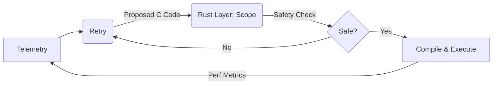

# Hybrid Combinatorics Architecture: The Safe-Performance Nexus
## Main Feature Definition

This document defines the core stability mechanism of the system: a **Combinatorics Method** that bridges the raw predictive power of C with the safety and performance guarantees of Rust.

### 1. The Core Philosophy
*   **C Layer (The Scout):** Responsible for **Predictive Operation Fetch**. It generates raw, unverified operation fragments based on combinatorial logic. It cannot execute code; it can only propose it.
*   **Rust Layer (The Architect):** Responsible for **Scope, Safety, and Finalization**. It has full visibility into the C fragments. It is the ONLY layer capable of constructing the **Final Point**—the immutable, safe execution block.
*   **The Nexus:** The transition where C-generated "suggestions" are transformed by Rust into the "Final Point".

### 2. The Combinatorics Method
This method ensures stability by treating code generation as a mathematical combination problem.

1.  **Generation:** The C Layer generates potential fragments (Combinations).
2.  **Scoping:** The Rust Layer "Scopes" these combinations.
3.  **Filtration:** Rust applies "Safe Operation" filters.
4.  **Finalization (The Final Point):** Rust takes the approved fragments and wraps them in a safe, validated execution object. **Only Rust can construct this final point.**
5.  **Execution:** The Rust-constructed Final Point is executed.

### 3. Architecture Layers

#### Layer A: The Predictive Fetcher (C)
*   **Role:** Speculative Fragment Generation.
*   **Output:** `Predictive Fragments` (Incomplete/Raw).

#### Layer B: The Final Point Constructor (Rust)
*   **Role:** Static Analysis & Final Assembly.
*   **Action:** `construct_final_point()` - Transmuting fragments into a safe execution unit.

#### Layer C: The Performance Executor (Binary)
*   **Role:** Running the approved logic.
*   **Behavior:** Executing the sanitized, optimized code at native speed.

### 4. Workflow

