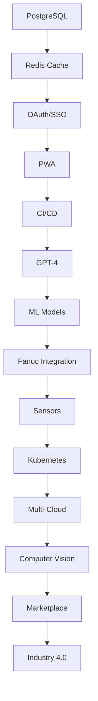

# 🗺️ CNC Copilot Platform - Implementation Roadmap
**Strategic Development Plan 2026-2028**

---

## 📋 Overview

**Timeline:** 24 months (Q1 2026 - Q4 2027)
**Total Phases:** 8 quarterly releases
**Team Size:** 4-6 developers
**Budget:** $500k - $750k

---

## 🎯 Vision & Goals

### **2026 Goals**
- ✅ Production-ready infrastructure
- ✅ Real hardware integration
- ✅ Mobile-first experience
- ✅ Advanced AI capabilities

### **2027 Goals**
- ✅ Enterprise scalability
- ✅ Industry 4.0 certification
- ✅ Complete ecosystem
- ✅ Market leadership

---

## 📅 Quarterly Roadmap

```
Q1 2026          Q2 2026          Q3 2026          Q4 2026
┌─────────────┐  ┌─────────────┐  ┌─────────────┐  ┌─────────────┐
│ Foundation  │  │ Intelligence│  │ Integration │  │ Enterprise  │
│   Phase     │  │    Phase    │  │    Phase    │  │    Phase    │
└─────────────┘  └─────────────┘  └─────────────┘  └─────────────┘

Q1 2027          Q2 2027          Q3 2027          Q4 2027
┌─────────────┐  ┌─────────────┐  ┌─────────────┐  ┌─────────────┐
│   Scale     │  │  Advanced   │  │  Ecosystem  │  │ Excellence  │
│   Phase     │  │     AI      │  │    Phase    │  │    Phase    │
└─────────────┘  └─────────────┘  └─────────────┘  └─────────────┘
```

---

## 🚀 Phase 1: Foundation (Q1 2026)
**Duration:** 12 weeks | **Focus:** Infrastructure & Core Systems

### Week 1-2: Database Migration
- [ ] **PostgreSQL Setup**
  - Install PostgreSQL 15
  - Configure connection pooling (PgBouncer)
  - Setup automated backups
  - Performance tuning
  
- [ ] **Data Migration**
  - Export SQLite data
  - Transform and import to PostgreSQL
  - Validate data integrity
  - Update Django settings

**Deliverable:** Production database ready

---

### Week 3: Caching Layer
- [ ] **Redis Integration**
  - Install Redis 7
  - Configure Django cache backend
  - Implement session storage
  - Setup cache invalidation
  - Add rate limiting

**Deliverable:** 3-5x performance improvement

---

### Week 4-6: Security Enhancements
- [ ] **OAuth 2.0 / SSO**
  - Install django-allauth
  - Configure Azure AD
  - Google Workspace integration
  - Testing & documentation

- [ ] **Two-Factor Authentication**
  - Install django-otp
  - TOTP implementation
  - SMS provider integration (Twilio)
  - User onboarding flow

**Deliverable:** Enterprise-grade authentication

---

### Week 7-9: Mobile PWA
- [ ] **Progressive Web App**
  - Service worker implementation
  - Offline data caching
  - Push notification setup
  - App manifest configuration
  - Install prompts
  - Responsive design improvements

**Deliverable:** Installable mobile app

---

### Week 10-12: CI/CD Pipeline
- [ ] **Automation Setup**
  - GitHub Actions workflows
  - Automated testing pipeline
  - Docker image building
  - Staging deployment
  - Production deployment with approval
  - Rollback procedures

**Deliverable:** Automated deployments

---

### Phase 1 Metrics
- ✅ Database migration: 100% data integrity
- ✅ API response time: < 200ms (p95)
- ✅ PWA install rate: > 30%
- ✅ Deployment time: < 10 minutes

---

## 🧠 Phase 2: Intelligence (Q2 2026)
**Duration:** 12 weeks | **Focus:** AI & Analytics

### Week 1-2: GPT-4 Integration
- [ ] **Advanced LLM**
  - Upgrade to GPT-4 Turbo
  - Implement streaming responses
  - Token optimization
  - Cost monitoring
  - Prompt engineering templates

**Deliverable:** Better AI suggestions

---

### Week 3-10: Predictive Maintenance ML
- [ ] **ML Model Development**
  - Data collection pipeline
  - Feature engineering
  - LSTM model training
  - Model evaluation
  - Real-time inference server
  - Alert system integration

- [ ] **Deployment**
  - TensorFlow Serving
  - Model versioning
  - A/B testing framework
  - Monitoring & retraining

**Deliverable:** Failure prediction system

---

### Week 6-12: Advanced Reporting
- [ ] **BI Dashboard**
  - OEE tracking dashboard
  - Production analytics
  - Cost analysis reports
  - Quality metrics (Cpk, DPMO)
  - Energy consumption tracking

- [ ] **Custom Report Builder**
  - Drag-drop interface
  - Report templates
  - Scheduled generation
  - PDF/Excel export

**Deliverable:** Executive dashboards

---

### Week 10-12: Monitoring Stack
- [ ] **Observability**
  - Prometheus metrics
  - Grafana dashboards
  - Loki log aggregation
  - Alerting rules
  - SLA monitoring

**Deliverable:** Complete observability

---

### Phase 2 Metrics
- ✅ Prediction accuracy: > 85%
- ✅ Report generation: < 5 seconds
- ✅ Alert response time: < 30 seconds
- ✅ Dashboard load time: < 1 second

---

## 🔌 Phase 3: Integration (Q3 2026)
**Duration:** 12 weeks | **Focus:** Hardware & Systems

### Week 1-6: Fanuc FOCAS Integration
- [ ] **Hardware Connection**
  - FOCAS library installation
  - Network configuration
  - Real-time data streaming
  - Program upload/download
  - Parameter management
  - Alarm monitoring

**Deliverable:** Live CNC connection

---

### Week 4-6: Sensor Integration
- [ ] **IoT Sensors**
  - Vibration sensors (accelerometers)
  - Temperature sensors
  - Current sensors (power monitoring)
  - Modbus/OPC UA protocols
  - Edge gateway setup

**Deliverable:** Multi-sensor monitoring

---

### Week 7-12: ERP Integration
- [ ] **SAP/Oracle Integration**
  - API authentication
  - Data mapping
  - Real-time sync
  - Error handling
  - Conflict resolution

- [ ] **Odoo Integration**
  - REST API integration
  - Inventory sync
  - Purchase order automation

**Deliverable:** ERP connectivity

---

### Week 8-12: Mobile Native Apps
- [ ] **React Native Development**
  - iOS app (TestFlight)
  - Android app (Play Store Beta)
  - Push notifications
  - Offline sync
  - Biometric auth

**Deliverable:** Native mobile apps

---

### Phase 3 Metrics
- ✅ Hardware uptime: > 99%
- ✅ Data sync delay: < 5 seconds
- ✅ Mobile app rating: > 4.5 stars
- ✅ Sensor accuracy: ± 2%

---

## 🏢 Phase 4: Enterprise (Q4 2026)
**Duration:** 12 weeks | **Focus:** Scalability & Compliance

### Week 1-6: Kubernetes Deployment
- [ ] **Container Orchestration**
  - K8s cluster setup (EKS/AKS)
  - Helm charts
  - Auto-scaling policies
  - Load balancing
  - Rolling updates
  - Health checks

**Deliverable:** Production K8s cluster

---

### Week 3-6: GraphQL API
- [ ] **Flexible API**
  - Graphene-Django setup
  - Schema definition
  - Query optimization
  - Apollo Client integration
  - Subscriptions for real-time

**Deliverable:** GraphQL endpoint

---

### Week 7-12: Compliance & Security
- [ ] **GDPR Compliance**
  - Data export functionality
  - Right to deletion
  - Consent management
  - Privacy policy updates

- [ ] **ISO 27001 Preparation**
  - Security audit
  - Documentation
  - Risk assessment
  - Access controls

**Deliverable:** Compliance certifications

---

### Phase 4 Metrics
- ✅ Cluster uptime: 99.9%
- ✅ Auto-scaling: < 30 seconds
- ✅ GDPR compliance: 100%
- ✅ Security audit: Pass

---

## 📈 Phase 5: Scale (Q1 2027)
**Duration:** 12 weeks | **Focus:** Performance & Growth

### Week 1-4: Multi-Cloud Strategy
- [ ] **Cloud Providers**
  - AWS primary deployment
  - Azure backup region
  - GCP for ML workloads
  - Cross-cloud load balancing
  - Disaster recovery

**Deliverable:** Multi-cloud architecture

---

### Week 5-8: Global CDN
- [ ] **Content Delivery**
  - CloudFlare integration
  - Edge caching
  - DDoS protection
  - SSL/TLS optimization
  - Global load balancing

**Deliverable:** < 100ms worldwide latency

---

### Week 9-12: Advanced Caching
- [ ] **Performance Optimization**
  - Redis Cluster
  - Query result caching
  - API response caching
  - Edge caching strategies
  - Cache warming

**Deliverable:** 10x performance improvement

---

### Phase 5 Metrics
- ✅ Global latency: < 100ms
- ✅ Uptime: 99.99%
- ✅ Traffic capacity: 1M requests/hour
- ✅ Cost per request: < $0.001

---

## 🤖 Phase 6: Advanced AI (Q2 2027)
**Duration:** 12 weeks | **Focus:** Computer Vision & ML

### Week 1-8: Computer Vision
- [ ] **Quality Inspection**
  - YOLOv8 model training
  - Defect detection
  - Dimensional verification
  - Real-time inference
  - Edge deployment (Jetson)

**Deliverable:** Automated QC system

---

### Week 6-12: Advanced ML
- [ ] **Process Optimization**
  - Reinforcement learning
  - Parameter optimization
  - Energy optimization
  - Cycle time reduction
  - Multi-objective optimization

**Deliverable:** Self-optimizing system

---

### Week 8-12: Local LLM
- [ ] **On-Premise AI**
  - LLaMA 3 deployment
  - GPU cluster setup
  - Fine-tuning pipeline
  - Privacy-first AI

**Deliverable:** Private AI assistant

---

### Phase 6 Metrics
- ✅ Defect detection: > 95% accuracy
- ✅ Optimization gain: 15-20%
- ✅ Inference time: < 100ms
- ✅ LLM latency: < 2 seconds

---

## 🌐 Phase 7: Ecosystem (Q3 2027)
**Duration:** 12 weeks | **Focus:** Integrations & Platform

### Week 1-4: Component Marketplace
- [ ] **Community Platform**
  - Component upload/download
  - Rating & reviews
  - Version management
  - Revenue sharing (premium)

**Deliverable:** Active marketplace

---

### Week 5-8: API Ecosystem
- [ ] **Developer Platform**
  - API documentation (Swagger)
  - SDKs (Python, JS, Go)
  - Sandbox environment
  - Developer portal
  - API analytics

**Deliverable:** Developer ecosystem

---

### Week 9-12: Third-Party Integrations
- [ ] **Integration Hub**
  - Zapier integration
  - Make.com connectors
  - Webhooks
  - Custom connectors
  - Integration templates

**Deliverable:** 50+ integrations

---

### Phase 7 Metrics
- ✅ Marketplace listings: > 100
- ✅ API users: > 500
- ✅ Integrations: > 50
- ✅ Developer satisfaction: > 4.5/5

---

## 🏆 Phase 8: Excellence (Q4 2027)
**Duration:** 12 weeks | **Focus:** Polish & Innovation

### Week 1-4: AR/VR Capabilities
- [ ] **Immersive Training**
  - WebXR implementation
  - Unity VR app
  - AR work instructions
  - HoloLens integration

**Deliverable:** VR training system

---

### Week 5-8: Robotics Integration
- [ ] **Automation**
  - KUKA/ABB/FANUC robots
  - Cobot programming
  - Vision-guided robotics
  - Safety systems

**Deliverable:** Robot integration

---

### Week 9-12: Industry 4.0 Certification
- [ ] **Smart Factory**
  - Digital twin implementation
  - Cyber-physical systems
  - IoT platform certification
  - Smart manufacturing badge

**Deliverable:** Industry 4.0 certified

---

### Phase 8 Metrics
- ✅ Training effectiveness: +50%
- ✅ Robot uptime: > 95%
- ✅ Digital twin accuracy: > 98%
- ✅ Industry recognition: Top 10

---

## 📊 Dependencies & Critical Path



---

## 💰 Budget Allocation

### Year 1 (2026): $300k - $400k
- **Personnel:** $240k (60%)
  - Backend Dev: $70k
  - Frontend Dev: $60k
  - ML Engineer: $70k
  - DevOps: $40k

- **Infrastructure:** $40k (10%)
  - AWS/Azure: $24k
  - Redis/PostgreSQL: $8k
  - Monitoring: $8k

- **Software Licenses:** $20k (5%)
  - IDE licenses
  - Design tools
  - Testing tools

- **AI/ML:** $60k (15%)
  - OpenAI API: $30k
  - GPU compute: $20k
  - Training data: $10k

- **Contingency:** $40k (10%)

### Year 2 (2027): $200k - $350k
- Focus on scaling, not building
- Reduced dev team (maintenance mode)
- Increased infrastructure costs

---

## 🎯 Success Metrics (KPIs)

### Technical KPIs
| Metric | Current | Q2 2026 | Q4 2026 | Q4 2027 |
|--------|---------|---------|---------|---------|
| API Latency (p95) | 500ms | 200ms | 100ms | 50ms |
| Uptime | 95% | 99% | 99.9% | 99.99% |
| Test Coverage | 40% | 70% | 85% | 95% |
| Deployment Time | Manual | 15min | 10min | 5min |
| Bug Resolution | 5 days | 3 days | 1 day | 4 hours |

### Business KPIs
| Metric | Current | Q2 2026 | Q4 2026 | Q4 2027 |
|--------|---------|---------|---------|---------|
| Active Users | 50 | 200 | 500 | 2000 |
| OEE Improvement | 0% | 10% | 20% | 35% |
| Downtime Reduction | 0% | 15% | 25% | 40% |
| Cost Savings | $0 | $50k | $150k | $500k |
| Customer Satisfaction | 3.5/5 | 4.0/5 | 4.5/5 | 4.8/5 |

---

## ⚠️ Risk Management

### High-Risk Items
1. **Hardware Integration Failures**
   - Mitigation: Extensive testing, vendor support, fallback options

2. **Data Migration Issues**
   - Mitigation: Staged rollout, comprehensive backups, rollback plan

3. **ML Model Accuracy**
   - Mitigation: Multiple models, human-in-loop, continuous retraining

4. **Team Attrition**
   - Mitigation: Knowledge documentation, pair programming, retention bonuses

### Medium-Risk Items
- Cloud vendor lock-in → Multi-cloud strategy
- Security breaches → Regular audits, bug bounty
- Performance degradation → Load testing, monitoring
- Budget overruns → Phased approach, MVP mindset

---

## 🚦 Go/No-Go Decision Points

### After Phase 1 (Q1 2026)
**Criteria:**
- [ ] PostgreSQL migration successful
- [ ] < 5% performance degradation
- [ ] OAuth working with 2+ providers
- [ ] PWA install rate > 20%

**Decision:** Proceed to Phase 2 or address issues

---

### After Phase 3 (Q3 2026)
**Criteria:**
- [ ] Live hardware connection stable
- [ ] 3+ sensor types integrated
- [ ] ERP sync working
- [ ] Mobile apps in beta

**Decision:** Proceed to Phase 4 or pivot

---

### After Phase 6 (Q2 2027)
**Criteria:**
- [ ] Computer vision > 90% accurate
- [ ] ML optimization showing gains
- [ ] Customer satisfaction > 4.3/5

**Decision:** Proceed to ecosystem or consolidate

---

## 📅 Release Schedule

### 2026 Releases
- **v2.0** (Mar 2026) - Foundation Release
- **v2.1** (Jun 2026) - Intelligence Release
- **v2.2** (Sep 2026) - Integration Release
- **v2.3** (Dec 2026) - Enterprise Release

### 2027 Releases
- **v3.0** (Mar 2027) - Scale Release
- **v3.1** (Jun 2027) - AI Release
- **v3.2** (Sep 2027) - Ecosystem Release
- **v3.3** (Dec 2027) - Excellence Release

---

## 🎓 Team Growth Plan

### Q1 2026 (4 people)
- 2x Backend Developers
- 1x Frontend Developer
- 1x DevOps Engineer

### Q3 2026 (6 people)
- +1 ML Engineer
- +1 Mobile Developer

### Q1 2027 (8 people)
- +1 Computer Vision Engineer
- +1 QA Engineer

### Q3 2027 (10 people)
- +1 Product Manager
- +1 Technical Writer

---

## 📚 Training & Knowledge Transfer

### Developer Onboarding
- Week 1: Codebase overview
- Week 2: Local development setup
- Week 3: First contribution
- Week 4: Independent work

### Continuous Learning
- Monthly tech talks
- Quarterly certifications
- Conference attendance (2/year)
- Online courses (Udemy, Pluralsight)

---

## 🎉 Milestones & Celebrations

### Major Milestones
1. ✅ **First Production Deployment** (Q1 2026)
2. ✅ **100 Active Users** (Q2 2026)
3. ✅ **First Live CNC Connection** (Q3 2026)
4. ✅ **99.9% Uptime Achieved** (Q4 2026)
5. ✅ **1000 Users** (Q2 2027)
6. ✅ **Industry 4.0 Certified** (Q4 2027)

---

## 📞 Stakeholder Communication

### Weekly
- Dev team standup
- Progress updates

### Monthly
- Executive summary
- KPI dashboard
- Budget review

### Quarterly
- Release retrospective
- Roadmap adjustment
- Strategic planning

---

## 🔄 Feedback Loops

### User Feedback
- In-app feedback widget
- Monthly user surveys
- Quarterly focus groups
- Support ticket analysis

### Technical Feedback
- Code reviews
- Performance monitoring
- Error tracking
- Load testing

---

**Last Updated:** January 23, 2026
**Next Review:** March 31, 2026
**Version:** 1.0
