# FANUC RISE: System Architecture & Flow Map

This document maps the complete data flow of the **Advanced CNC Copilot (v2.1)**, illustrating how the "Shadow Council" governs the physical machinery.

```mermaid
graph TD
    %% --- USERS & PERSONAS (Frontend) ---
    subgraph "Frontend: Multisite Interface (React)"
        User_OP[("👷 OPERATOR<br/>(Execution)")]
        User_MGR[("👔 MANAGER<br/>(Oversight)")]
        User_ENG[("🎨 CREATOR<br/>(Design)")]
        User_ADM[("🔴 ADMIN<br/>(Root)")]

        Router[("🧭 MultisiteRouter")]
        
        %% Layouts
        View_OP["OperatorLayout<br/>(Live Telemetry)"]
        View_MGR["ManagerLayout<br/>(Swarm Intelligence)"]
        View_ENG["CreativeLayout<br/>(Generative Studio)"]
        View_ADM["AdminLayout<br/>(System Health)"]

        User_OP --> Router --> View_OP
        User_MGR --> Router --> View_MGR
        User_ENG --> Router --> View_ENG
        User_ADM --> Router --> View_ADM
    end

    %% --- API GATEWAY (Backend) ---
    subgraph "Backend: Neural Core (FastAPI)"
        API[("⛩️ API Gateway")]
        Auth[("🛡️ Security (RBAC)")]
        
        View_OP <-->|WS / Telemetry| API
        View_MGR <-->|REST / Analytics| API
        View_ENG <-->|REST / Generate| API
        View_ADM <-->|REST / Config| API
    end

    %% --- THE SHADOW COUNCIL (Intelligence) ---
    subgraph "The Shadow Council (Async Agents)"
        Orchestrator[("🎼 Master Orchestrator")]
        Bus{{"⚡ Message Bus"}}
        
        Agent_Audit[("👮 Auditor Agent<br/>(Safety Rules)")]
        Agent_Dopa[("🧠 Dopamine Engine<br/>(RL Personality)")]
        Agent_Vision[("🧿 Vision Cortex<br/>(QC Inspection)")]
        
        API --> Orchestrator
        Orchestrator <--> Bus
        Bus <--> Agent_Audit
        Bus <--> Agent_Dopa
        Bus <--> Agent_Vision
    end

    %% --- DATA & HARDWARE ---
    subgraph "Infrastructure"
        DB[("💾 TimescaleDB<br/>(History)")]
        Redis[("⚡ Redis<br/>(Live State)")]
        
        Bridge[("🌉 FOCAS Bridge<br/>(ctypes)")]
        CNC[("🤖 Fanuc CNC<br/>(Physical Hardware)")]
        
        Orchestrator --> DB
        Orchestrator --> Redis
        Orchestrator --> Bridge
        Bridge <--> CNC
    end

    %% --- FLOWS ---
    %% 1. Audit Flow
    Orchestrator -- "DRAFT_PLAN" --> Bus
    Agent_Audit -- "VALIDATION_RESULT" --> Bus
    
    %% 2. Learning Flow
    CNC -- "Job Outcome" --> Bridge --> Orchestrator
    Orchestrator -- "Feedback" --> Agent_Dopa
    
    %% 3. Swarm Flow
    Redis -.-> View_MGR
```

## Data Flow Description

1.  **Intent Injection**: The **Creator** submits a generative design request via `CreativeLayout`.
2.  **Orchestration**: The **API** receives the request and forwards it to the **Master Orchestrator**.
3.  **The Council convenes**:
    *   The Orchestrator publishes a `DRAFT_PLAN`.
    *   The **Auditor Agent** analyzes the G-Code against `MasterPreferences` (Admin).
    *   If **Approved**, the plan is passed to the execution queue.
4.  **Execution**: The **Operator** sees the job in `OperatorLayout` and initiates the cycle.
5.  **Physical Link**: The **FOCAS Bridge** streams commands to the **Fanuc CNC**.
6.  **Feedback Loop**:
    *   Real-time telemetry (Load/Vibration) feeds the **Dopamine Engine**.
    *   Post-job quality (Vision) feeds the **Reinforcement Learning** model.
    *   The system updates its "Risk Tolerance" weights for the next cycle.
