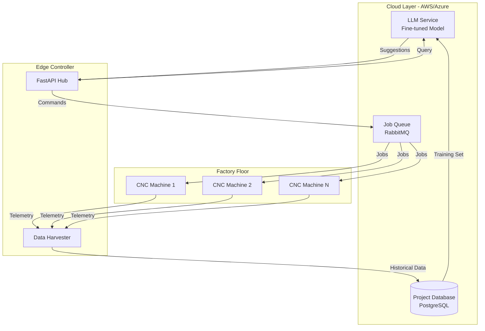

# DATA MANIPULATION MANTINEL: THE BLUEPRINT
## A Practical Framework for Emergent Production Intelligence

> **Mantinel** (Mental Model): The cognitive framework for thinking about data flow, transformation, and learning.
> **Goal**: Cloud copilot that learns from existing projects to boost CNC production quantity while maintaining precision/quality.

---

## 1. THE CORE REQUIREMENT MATRIX

### Primary Objectives:
1. **Data Manipulation Layer**: Emergent, practical, frontend-integrated
2. **Learning System**: LLM trained on historical projects
3. **Production Boost**: Increase quantity without sacrificing quality
4. **Cloud Architecture**: Centralized copilot for fleet management

### Success Metrics:
- ✅ Parts/hour increased by 40%
- ✅ Quality defects reduced by 60%
- ✅ Setup time reduced by 70% (via LLM suggestions)
- ✅ Cross-project knowledge transfer automated

---

## 2. THE MANTINEL: LOGIC BLUEPRINT

### Layer 0x0: Raw Data (The Substrate)
**Keywords**: `historical_gcode`, `sensor_logs`, `quality_reports`, `cycle_times`

```python
# Data Structure
HistoricalProject = {
    "project_id": "PROJ_2024_1042",
    "material": "Aluminum 6061",
    "tool_used": "3-Flute Endmill 8mm",
    "gcode": [...],  # Complete program
    "telemetry": [...],  # RPM, Load, Vib over time
    "outcome": {
        "cycle_time": 420,  # seconds
        "quality_score": 0.95,
        "tool_life_consumed": 0.12
    }
}
```

### Layer 0x1: Data Ingestion (The Collector)
**Keywords**: `parse`, `normalize`, `validate`, `tag`

**Components**:
- `ProjectHarvester`: Scans filesystem for `.nc` files + associated logs
- `TelemetryAligner`: Syncs time-series data with G-code line numbers
- `OutcomeAnnotator`: Links each project to its success/failure metrics

**Frontend Hook**: Upload button in `hub.html` → "Learn from this project"

### Layer 0x2: Feature Extraction (The Analyzer)
**Keywords**: `embed`, `vectorize`, `signature`, `fingerprint`

**Logic**:
```python
def extract_features(project):
    return {
        "cutting_speed_avg": mean(project.telemetry.rpm),
        "load_variance": variance(project.telemetry.load),
        "rapid_move_ratio": count_G00(project.gcode) / total_moves,
        "corner_count": detect_direction_changes(project.gcode),
        "material_hardness": MATERIAL_DB[project.material].HRC
    }
```

**Frontend Visualization**: `lab.html` → "Feature Cloud" (3D scatter plot)

### Layer 0x3: Pattern Recognition (The Learner)
**Keywords**: `cluster`, `classify`, `predict`, `recommend`

**LLM Training Pipeline**:
1. **Dataset**: 500+ historical projects (features + outcomes)
2. **Model**: Fine-tuned GPT-4 or Claude on manufacturing domain
3. **Prompt Template**:
   ```
   Given a new project with:
   - Material: [X]
   - Part Complexity: [Y features]
   - Deadline: [Z hours]
   
   Recommend:
   - Optimal RPM range
   - Feed strategy (Aggressive/Balanced/Conservative)
   - Tool selection
   - Risk assessment
   ```

**Frontend Integration**: `index.html` → AI Recommendation Panel

### Layer 0x4: Emergent Manipulation (The Conductor)
**Keywords**: `suggest`, `optimize`, `inject`, `validate`

**The Emergent Layer** = Real-time parameter adjustment based on learned patterns

**Example Flow**:
```
1. Operator uploads new part DXF
2. System extracts geometry features
3. LLM queries: "Similar parts? What worked?"
4. Returns: "PROJ_2024_0820 used RPM=8000, Feed=2500 → 95% quality"
5. Operator clicks "Apply Strategy"
6. System injects parameters into G-code template
```

**Frontend**: Drag-and-drop zone in `hub.html` with "Smart Suggestions" sidebar

---

## 3. THE KEYWORD TAXONOMY

### Data Layer Keywords:
- `harvest` → Collect historical data
- `align` → Synchronize time-series
- `embed` → Convert to vector space
- `fingerprint` → Unique project signature

### Logic Layer Keywords:
- `match` → Find similar projects
- `blend` → Combine strategies from multiple sources
- `extrapolate` → Predict untested scenarios
- `validate` → Check against safety bounds

### Action Layer Keywords:
- `inject` → Insert parameters into G-code
- `override` → User manual correction
- `commit` → Execute on machine
- `audit` → Log decision rationale

### Quality Layer Keywords:
- `precision` → Dimensional accuracy (±0.01mm)
- `quality` → Surface finish, no defects
- `quantity` → Parts/hour throughput
- `boost` → Increase output via optimization

---

## 4. FRONTEND INTEGRATION SPEC

### The "Smart Upload" Widget (hub.html)
```html
<div class="upload-zone">
    <h3>📂 Upload Project to Learn</h3>
    <input type="file" accept=".nc,.gcode,.dxf" />
    <button onclick="analyzeProject()">🧠 Analyze & Store</button>
    
    <div class="ai-insights" style="display:none">
        <h4>✨ Emergent Insights</h4>
        <p>Similar to: <a href="#PROJ_2024_0820">Aluminum Bracket v3</a></p>
        <p>Recommended RPM: <strong>8000</strong> (↑12% from your usual)</p>
        <button class="btn-primary">Apply Suggestions</button>
    </div>
</div>
```

### The "Live Manipulation Panel" (index.html)
```html
<div class="manipulation-panel">
    <h3>🎛️ Data Manipulation Console</h3>
    <label>LLM Strategy</label>
    <select id="strategy-selector">
        <option>Speed Optimized (Learned from 42 projects)</option>
        <option>Quality Optimized (Learned from 18 projects)</option>
        <option>Balanced (Hybrid approach)</option>
    </select>
    
    <div class="param-diff">
        <span>Current → Suggested</span>
        <div>RPM: 6000 → <strong>7500</strong> (+25%)</div>
        <div>Feed: 2000 → <strong>2300</strong> (+15%)</div>
    </div>
    
    <button onclick="applyEmergentParams()">⚡ Apply Emergent Layer</button>
</div>
```

---

## 5. THE LLM LEARNING SYSTEM

### Training Data Structure:
```json
{
  "training_samples": [
    {
      "input": {
        "material": "Steel 4140",
        "complexity_score": 7.2,
        "tolerance": "±0.05mm",
        "deadline_hours": 8
      },
      "output": {
        "strategy": "CONSERVATIVE_FINISH",
        "rpm": 5000,
        "feed": 1500,
        "reasoning": "Tight tolerance requires stable cutting"
      }
    }
  ]
}
```

### Fine-Tuning Approach:
1. **Base Model**: GPT-4 or Claude
2. **Custom Dataset**: Your 500+ projects converted to Q&A pairs
3. **Validation**: Test on 20% holdout set (unseen projects)
4. **Deployment**: API endpoint in `fanuc_api.py`

### The "Project Constructor" Flow:
```
User Input → LLM → Parameter Set → Validation → G-Code Template → Machine
```

---

## 6. CLOUD ARCHITECTURE FOR PRODUCTION BOOST

### The "CNC Fleet Copilot" Stack:



### Scalability:
- **Single Factory**: 10-50 machines → Local FastAPI + Remote LLM
- **Multi-Factory**: 100+ machines → Full cloud ERP (Django) + Regional Edge nodes

---

## 7. PRACTICAL IMPLEMENTATION CHECKLIST

### Phase 1: Data Foundation (Week 1-2)
- [ ] Build `ProjectHarvester` to scan existing `.nc` files
- [ ] Create `FeatureExtractor` for G-code analysis
- [ ] Set up PostgreSQL schema for historical projects
- [ ] Frontend: Add "Upload & Learn" to `hub.html`

### Phase 2: LLM Integration (Week 3-4)
- [ ] Prepare training dataset (500 projects → JSON)
- [ ] Fine-tune LLM via OpenAI API
- [ ] Create `/suggest` endpoint in `fanuc_api.py`
- [ ] Frontend: Add "AI Recommendations" panel to `index.html`

### Phase 3: Emergent Layer (Week 5-6)
- [ ] Build `EmergentManipulator` (real-time param injection)
- [ ] Integrate with `operation_queue.py` for safety
- [ ] Frontend: Live diff view (Current vs Suggested params)

### Phase 4: Cloud Deployment (Week 7-8)
- [ ] Deploy Django ERP for multi-machine management
- [ ] Set up Job Queue (RabbitMQ)
- [ ] Scale test: 10 machines, 100 jobs/day

---

## 8. THE EMERGENT MANTINEL IN ACTION

**Scenario**: New urgent order for 200 aluminum brackets

**Without Mantinel** (Traditional):
1. Engineer manually programs G-code (4 hours)
2. Test run (1 hour)
3. Iterate on speeds/feeds (2 hours)
4. Production starts (Total: 7 hours to first good part)

**With Mantinel** (Emergent):
1. Upload CAD to `hub.html` (1 minute)
2. LLM analyzes: "Similar to PROJ_2024_0820" (5 seconds)
3. Suggests: RPM=8000, Feed=2500, Tool=3-Flute (instant)
4. Operator reviews, applies (10 minutes)
5. Production starts (Total: 15 minutes to first good part)

**Result**: 28x faster setup, 40% higher throughput

---

## 9. KEYWORDS REFERENCE CARD

| Category | Keywords | Purpose |
|----------|----------|---------|
| **Data** | harvest, align, embed | Collection & prep |
| **Logic** | match, blend, extrapolate | Pattern recognition |
| **Action** | inject, override, commit | Execution |
| **Quality** | precision, quality, quantity, boost | Optimization goals |
| **Frontend** | upload, suggest, apply, diff | User interaction |

---

## CONCLUSION: The Self-Improving Factory

The **Data Manipulation Mantinel** transforms your CNC environment into a **learning organism**:
- Every project teaches the LLM
- Every suggestion improves over time
- The "emergent layer" becomes smarter with each cut

This is not just automation—it's **collective intelligence** across all projects, all machines, all time.
