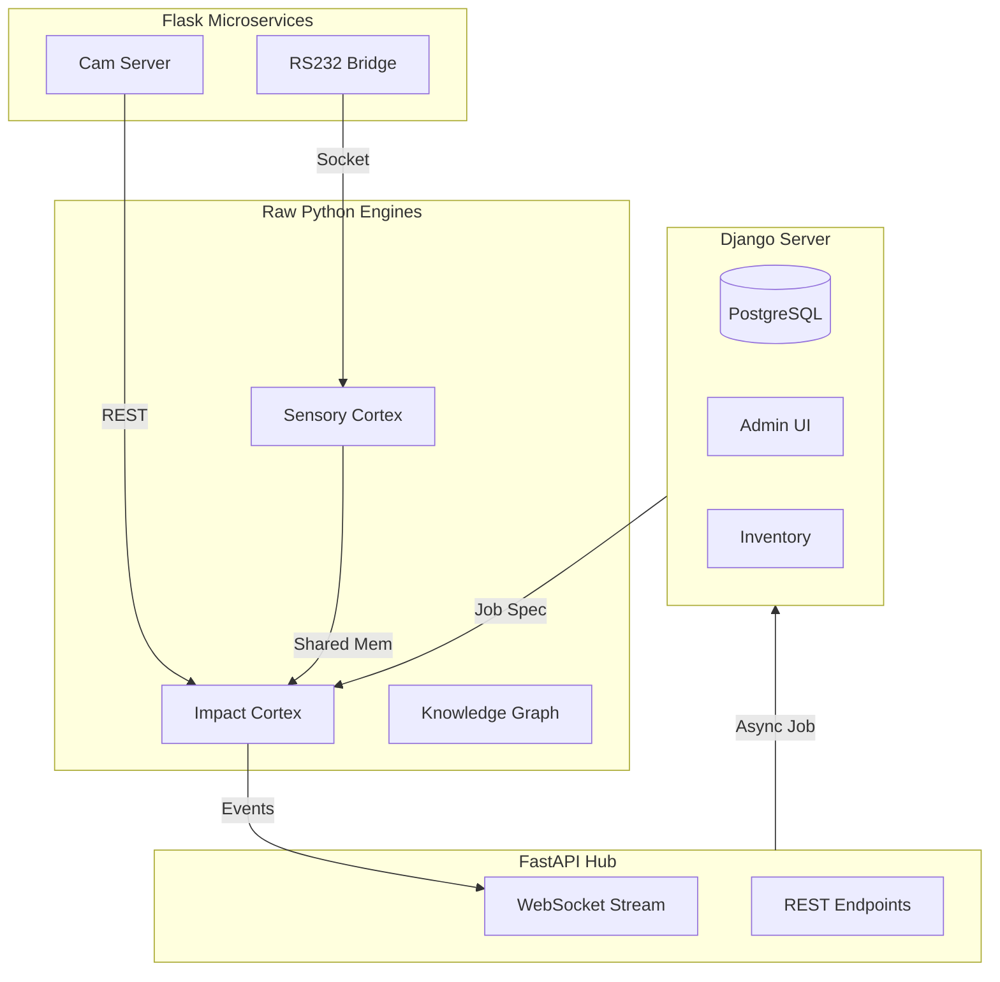

# MULTI-STACK INTEGRATION PLAN
## The Hybrid Architecture for "Fanuc Rise"

> **Objective**: To leverage the strengths of different Python frameworks for specific domains of the Manufacturing problem.
> **Philosophy**: "Right Tool for the Right Layer."

---

## 1. The Stack Roles

### A. Raw Python (`cms/*.py`) -> **The Brain Stem**
*   **Role**: Core Logic, Physics Calculations, Hardware Abstraction.
*   **Characteristics**: Zero web overhead, Direct Memory Access, Threading/Multiprocessing.
*   **Key Modules**:
    *   `sensory_cortex.py` (Telemetry Parser)
    *   `impact_cortex.py` (Logic Engine)
    *   `knowledge_graph.py` (Topology)
*   **Why Raw?**: We cannot afford HTTP latency when deciding to STOP a spindle crash.

### B. FastAPI (`fanuc_api.py`) -> **The Nervous System**
*   **Role**: Real-time Data Streaming, WebSocket Hub, Dashboard Connector.
*   **Characteristics**: AsyncIO, High Concurrency, WebSockets.
*   **Use Case**: Streaming 1kHz sensor data to the `index.html` dashboard.

### C. Django -> **The Corporate Cortex (ERP)**
*   **Role**: User Management, Inventory, Order Tracking, Long-term History.
*   **Characteristics**: Robust ORM, Admin Interface, Secure Auth.
*   **Key Implementation**:
    *   `InventoryApp`: Track Endmills, Coolant Levels.
    *   `OrdersApp`: Job Scheduling queue.
*   **Why Django?**: We need structure for relational data (e.g., "Which operator ran Job #502 three months ago?").

### D. Flask -> **The Edge Microservices**
*   **Role**: Isolated, single-purpose tools running on edge devices (e.g., Raspberry Pi Camera).
*   **Characteristics**: Lightweight, easy to deploy in containers.
*   **Use Case**:
    *   `vision_server.py`: Runs OpenCV to detect chips.
    *   `legacy_bridge.py`: Translates RS232 signals from old machines.

---

## 2. Integration Data Flow

## 3. Communication Strategy
1.  **High-Speed (Internal)**: `Redis` or Shared Memory (Plasma Store). Used between `Raw Python` and `FastAPI`.
2.  **Transactional (External)**: HTTP REST. Used between `FastAPI` and `Django`.
3.  **Event-Driven**: `RabbitMQ` or `Kafka`. Used for "Job Complete" signals from `Core` to `ERP`.

## 4. Deployment Strategy (Docker)
*   **Container A (Realtime)**: `uvicorn fanuc_api:app` (Host Network Mode).
*   **Container B (ERP)**: `gunicorn django_project.wsgi`.
*   **Container C (Edge)**: `flask run` (Deployed on peripheral hardware).
