# DJANGO INTEGRATION CONSPECT
## Complete Feature Mapping & Implementation Guide

---

## 🎯 SOFTWARE ARCHITECTURE DIVISION (Analogy Device)

```mermaid
graph TB
    subgraph PRESENTATION [🎨 Presentation Layer - Frontend]
        HTML[HTML/CSS Dashboard]
        JS[JavaScript app.js]
        CHARTS[Chart.js Visualizations]
    end
    
    subgraph APPLICATION [⚙️ Application Layer - Django]
        VIEWS[Django Views]
        MODELS[DB Models/ORM]
        ADMIN[Admin Interface]
        REST[REST API - DRF]
    end
    
    subgraph BUSINESS [🧠 Business Logic - Core Python]
        SENSORY[Sensory Cortex]
        DOPAMINE[Dopamine Engine]
        IMPACT[Impact Cortex]
        PROTOCOL[Protocol Conductor]
    end
    
    subgraph DATA [💾 Data Layer]
        PG[(PostgreSQL)]
        REDIS[(Redis Cache)]
        TS[(TimescaleDB)]
    end
    
    HTML --> JS
    JS --> REST
    REST --> VIEWS
    VIEWS --> MODELS
    MODELS --> PG
    
    VIEWS --> SENSORY
    SENSORY --> DOPAMINE
    DOPAMINE --> IMPACT
    IMPACT --> PROTOCOL
    
    SENSORY --> TS
    VIEWS --> REDIS
```



---

## 1. FEATURE MATRIX (Conspect of Related Features)

### Category A: **User Management** (Django Native)
| Feature | Django Component | Frontend View | Business Logic |
|---------|-----------------|---------------|----------------|
| Registration | `User model`, `CreateView` | `login.html` | None (Django auth) |
| Login/Logout | `LoginView`, session mgmt | `login.html` | JWT generation |
| Role-based Access | `PermissionsMixin` | Hidden buttons | `cloud_auth_model.py` |
| Profile Management | `UpdateView` | `profile.html` | None |

**Django Code Example**:
```python
# erp/models.py
from django.contrib.auth.models import AbstractUser

class RiseUser(AbstractUser):
    role = models.CharField(max_length=20, choices=[
        ('ADMIN', 'Administrator'),
        ('ENGINEER', 'Design Engineer'),
        ('OPERATOR', 'Machine Operator'),
        ('AUDITOR', 'Quality Auditor')
    ])
    organization = models.ForeignKey('Organization', on_delete=models.CASCADE)
    
    class Meta:
        permissions = [
            ("can_override_safety", "Can override safety limits"),
            ("can_view_economics", "Can view cost analytics"),
        ]
```

---

### Category B: **Machine Management** (Django + Core)
| Feature | Django Component | Frontend View | Business Logic |
|---------|-----------------|---------------|----------------|
| Machine Registry | `Machine model` | `machines/list.html` | None |
| Telemetry Logging | `Telemetry model` (TimescaleDB) | `index.html` dashboard | `sensory_cortex.py` |
| Status Monitoring | `ListView` + WebSocket | Live badges | `signaling_system.py` |
| Maintenance Schedule | `MaintenanceLog model` | `maintenance.html` | `predictive_maintenance.py` |

**Django Code Example**:
```python
# erp/models.py
class Machine(models.Model):
    name = models.CharField(max_length=100)
    controller_type = models.CharField(max_length=50)  # Fanuc, Siemens, etc.
    ip_address = models.GenericIPAddressField()
    is_active = models.BooleanField(default=True)
    last_heartbeat = models.DateTimeField(auto_now=True)
    
    # Connection to HAL
    def get_sensory_cortex(self):
        from cms.sensory_cortex import SensoryCortex
        return SensoryCortex(machine_id=self.id, ip=self.ip_address)

class Telemetry(models.Model):
    time = models.DateTimeField(db_index=True)
    machine = models.ForeignKey(Machine, on_delete=models.CASCADE)
    rpm = models.IntegerField()
    load = models.FloatField()
    vibration_x = models.FloatField()
    vibration_y = models.FloatField()
    vibration_z = models.FloatField()
    dopamine = models.FloatField()
    signal = models.CharField(max_length=10)  # GREEN/AMBER/RED
    
    class Meta:
        indexes = [
            models.Index(fields=['machine', '-time']),
        ]
```

---

### Category C: **Project/G-Code Management** (Django + LLM)
| Feature | Django Component | Frontend View | Business Logic |
|---------|-----------------|---------------|----------------|
| G-Code Upload | `FileField` | `projects/upload.html` | `project_harvester.py` |
| Similarity Search | Custom queryset | `projects/suggest.html` | `feature_extractor.py` |
| LLM Suggestions | Celery task | AJAX call | `protocol_conductor.py` |
| Version Control | `HistoricalRecords` | Diff view | None |

**Django Code Example**:
```python
# erp/models.py
class Project(models.Model):
    name = models.CharField(max_length=200)
    gcode = models.TextField()
    created_by = models.ForeignKey(RiseUser, on_delete=models.SET_NULL, null=True)
    created_at = models.DateTimeField(auto_now_add=True)
    
    # Extracted features (for similarity matching)
    material = models.CharField(max_length=50)
    complexity_score = models.FloatField()
    estimated_cycle_time = models.FloatField()
    
    # Outcomes (for LLM training)
    actual_cycle_time = models.FloatField(null=True)
    quality_score = models.FloatField(null=True)
    success = models.BooleanField(default=False)
    
    def get_similar_projects(self, limit=5):
        """Find similar projects for LLM context"""
        from cms.feature_extractor import calculate_similarity
        all_projects = Project.objects.filter(success=True).exclude(id=self.id)
        
        similarities = []
        for proj in all_projects:
            score = calculate_similarity(self, proj)
            similarities.append((score, proj))
        
        similarities.sort(reverse=True)
        return [proj for score, proj in similarities[:limit]]
    
    def request_llm_suggestion(self):
        """Async task to get LLM recommendation"""
        from cms.protocol_conductor import ProtocolConductor
        conductor = ProtocolConductor()
        
        context = {
            "material": self.material,
            "complexity": self.complexity_score,
            "similar_projects": self.get_similar_projects()
        }
        
        return conductor.suggest_parameters(context)
```

---

### Category D: **Economics & Analytics** (Django + Visualization)
| Feature | Django Component | Frontend View | Business Logic |
|---------|-----------------|---------------|----------------|
| Cost Calculation | Custom Manager | `economics/dashboard.html` | `manufacturing_economics.py` |
| ROI Tracking | Aggregation queries | Charts | None |
| Export Reports | CSV/PDF generation | Download button | None |
| Comparative Analysis | Queryset filters | Multi-select | None |

**Django Code Example**:
```python
# erp/models.py
class EconomicRecord(models.Model):
    project = models.ForeignKey(Project, on_delete=models.CASCADE)
    machine = models.ForeignKey(Machine, on_delete=models.CASCADE)
    
    # Costs breakdown
    machine_time_cost = models.DecimalField(max_digits=10, decimal_places=2)
    material_cost = models.DecimalField(max_digits=10, decimal_places=2)
    tool_cost = models.DecimalField(max_digits=10, decimal_places=2)
    total_cost = models.DecimalField(max_digits=10, decimal_places=2)
    
    # Metrics
    cycle_time = models.FloatField()  # minutes
    throughput = models.FloatField()  # parts/hour
    
    @classmethod
    def calculate_roi(cls, old_params, new_params):
        """Compare traditional vs AI-optimized"""
        from cms.manufacturing_economics import ManufacturingEconomics
        
        eco = ManufacturingEconomics()
        old_cost = eco.calculate(old_params)
        new_cost = eco.calculate(new_params)
        
        savings = old_cost - new_cost
        roi_percent = (savings / old_cost) * 100
        
        return {
            "old_cost": old_cost,
            "new_cost": new_cost,
            "savings": savings,
            "roi_percent": roi_percent
        }
```

---

## 2. DJANGO VIEWS STRUCTURE

### A. Dashboard Views (Main Interface)

```python
# erp/views.py
from django.views.generic import TemplateView, ListView
from django.contrib.auth.mixins import LoginRequiredMixin, PermissionRequiredMixin

class DashboardView(LoginRequiredMixin, TemplateView):
    template_name = 'dashboard/index.html'
    
    def get_context_data(self, **kwargs):
        context = super().get_context_data(**kwargs)
        
        # Get user's machines
        user_machines = Machine.objects.filter(
            organization=self.request.user.organization,
            is_active=True
        )
        
        # Fetch current telemetry
        from cms.sensory_cortex import SensoryCortex
        telemetry_data = []
        for machine in user_machines:
            cortex = machine.get_sensory_cortex()
            telemetry_data.append(cortex.get_current_state())
        
        context['machines'] = user_machines
        context['telemetry'] = telemetry_data
        context['user_role'] = self.request.user.role
        
        return context

class MachineListView(LoginRequiredMixin, ListView):
    model = Machine
    template_name = 'machines/list.html'
    context_object_name = 'machines'
    
    def get_queryset(self):
        return Machine.objects.filter(
            organization=self.request.user.organization
        )

class EconomicsDashboardView(PermissionRequiredMixin, TemplateView):
    template_name = 'economics/dashboard.html'
    permission_required = 'erp.can_view_economics'
    
    def get_context_data(self, **kwargs):
        context = super().get_context_data(**kwargs)
        
        # Aggregate economics data
        from django.db.models import Avg, Sum
        records = EconomicRecord.objects.filter(
            machine__organization=self.request.user.organization
        )
        
        context['avg_cost_per_part'] = records.aggregate(Avg('total_cost'))
        context['total_savings'] = records.aggregate(Sum('savings'))
        
        return context
```

---

### B. REST API Views (Django REST Framework)

```python
# erp/api_views.py
from rest_framework import viewsets, permissions
from rest_framework.decorators import action
from rest_framework.response import Response

class MachineViewSet(viewsets.ModelViewSet):
    queryset = Machine.objects.all()
    serializer_class = MachineSerializer
    permission_classes = [permissions.IsAuthenticated]
    
    def get_queryset(self):
        return Machine.objects.filter(
            organization=self.request.user.organization
        )
    
    @action(detail=True, methods=['get'])
    def telemetry(self, request, pk=None):
        """Get current telemetry for specific machine"""
        machine = self.get_object()
        cortex = machine.get_sensory_cortex()
        data = cortex.get_current_state()
        return Response(data)
    
    @action(detail=True, methods=['post'])
    def suggest_params(self, request, pk=None):
        """LLM parameter suggestion"""
        machine = self.get_object()
        material = request.data.get('material')
        complexity = request.data.get('complexity')
        
        from cms.protocol_conductor import ProtocolConductor
        conductor = ProtocolConductor()
        suggestion = conductor.suggest_parameters({
            'material': material,
            'complexity': complexity,
            'machine_type': machine.controller_type
        })
        
        return Response(suggestion)

class ProjectViewSet(viewsets.ModelViewSet):
    queryset = Project.objects.all()
    serializer_class = ProjectSerializer
    
    @action(detail=True, methods=['get'])
    def similar(self, request, pk=None):
        """Find similar projects"""
        project = self.get_object()
        similar = project.get_similar_projects(limit=10)
        serializer = self.get_serializer(similar, many=True)
        return Response(serializer.data)
```

---

## 3. FRONTEND INTEGRATION LAYERS

### Layer 1: Static Templates (Django Template Language)

```html
<!-- templates/dashboard/index.html -->




<div class="dashboard-container">
    <h1>Welcome, {{ user.get_full_name }}</h1>
    <p>Role: {{ user_role }}</p>
    
    <!-- Machine Status Cards -->
    <div class="machine-grid">
        
        <div class="machine-card" data-machine-id="{{ machine.id }}">
            <h3>{{ machine.name }}</h3>
            <div class="live-metrics" id="metrics-{{ machine.id }}">
                <!-- Will be populated by JavaScript -->
            </div>
        </div>
        
    </div>
    
    <!-- Permissions-based buttons -->
    
    <button onclick="overrideSafety()">Override Safety</button>
    
</div>

<script src=""></script>

```

---

### Layer 2: Dynamic Updates (JavaScript API Calls)

```javascript
// static/js/dashboard.js
class DjangoDashboard {
    constructor() {
        this.apiBase = '/api/v1';  // Django REST endpoints
        this.wsBase = 'ws://localhost:8000/ws';  // WebSocket
    }
    
    async fetchMachineTelemetry(machineId) {
        const response = await fetch(`${this.apiBase}/machines/${machineId}/telemetry/`);
        return await response.json();
    }
    
    async requestLLMSuggestion(machineId, material, complexity) {
        const response = await fetch(`${this.apiBase}/machines/${machineId}/suggest_params/`, {
            method: 'POST',
            headers: {
                'Content-Type': 'application/json',
                'X-CSRFToken': getCookie('csrftoken')  // Django CSRF
            },
            body: JSON.stringify({ material, complexity })
        });
        return await response.json();
    }
    
    updateMachineCard(machineId, telemetry) {
        const card = document.getElementById(`metrics-${machineId}`);
        card.innerHTML = `
            <div>RPM: ${telemetry.rpm}</div>
            <div>Load: ${telemetry.load}%</div>
            <div class="signal-${telemetry.signal.toLowerCase()}">
                Signal: ${telemetry.signal}
            </div>
        `;
    }
    
    startLiveUpdates() {
        setInterval(async () => {
            const machines = document.querySelectorAll('[data-machine-id]');
            for (const card of machines) {
                const machineId = card.dataset.machineId;
                const telemetry = await this.fetchMachineTelemetry(machineId);
                this.updateMachineCard(machineId, telemetry);
            }
        }, 1000);  // 1Hz update
    }
}

// Initialize
const dashboard = new DjangoDashboard();
dashboard.startLiveUpdates();
```

---

## 4. INTEGRATION ANALOGY DEVICE

### **Analogy**: Django = City Infrastructure

| City Component | Django Component | Fanuc Rise Equivalent |
|----------------|------------------|----------------------|
| **City Hall** | Admin Interface | User/Machine management |
| **Roads** | URL routing | API endpoints |
| **Database** | ORM Models | PostgreSQL/TimescaleDB |
| **Police** | Permissions | RBAC, safety overrides |
| **Libraries** | Static files | Dashboard CSS/JS |
| **Telephone** | WebSockets | Real-time telemetry |
| **Scientists** | Business Logic | Core Python modules |

**Data Flow Analogy**:
```
User request → URL (Road) → View (City Hall) → Model (Database Records) 
→ Core Logic (Scientists analyze) → Response (Report back to citizen)
```

---

## 5. DJANGO SETTINGS FOR FANUC RISE

```python
# settings.py
INSTALLED_APPS = [
    'django.contrib.admin',
    'django.contrib.auth',
    'django.contrib.contenttypes',
    'django.contrib.sessions',
    'django.contrib.messages',
    'django.contrib.staticfiles',
    
    # Third-party
    'rest_framework',
    'channels',  # WebSockets
    'django_celery_results',  # Async tasks
    
    # Our apps
    'erp',  # ERP layer
    'cms',  # Core logic (imports only, no models)
]

# Database (with TimescaleDB)
DATABASES = {
    'default': {
        'ENGINE': 'django.db.backends.postgresql',
        'NAME': 'fanuc_rise',
        'USER': 'postgres',
        'PASSWORD': 'changeme123',
        'HOST': 'localhost',
        'PORT': '5432',
    }
}

# Celery (for async LLM tasks)
CELERY_BROKER_URL = 'redis://localhost:6379/0'
CELERY_RESULT_BACKEND = 'django-db'

# WebSocket (Channels)
ASGI_APPLICATION = 'fanuc_rise.asgi.application'
CHANNEL_LAYERS = {
    'default': {
        'BACKEND': 'channels_redis.core.RedisChannelLayer',
        'CONFIG': {
            "hosts": [('localhost', 6379)],
        },
    },
}

# Static files
STATIC_URL = '/static/'
STATICFILES_DIRS = [BASE_DIR / 'cms' / 'dashboard']
```

---

**ZÁVER**: Tento conspect mapuje všetky features na 3 vrstvy (Django, Core Python, Frontend) s presnou integráciou. Django slúži ako "ERP spine" zatiaľ čo Core Python moduly robia heavy lifting.

*Conspect by Dusan Berger, complete integration guide, January 2026*
