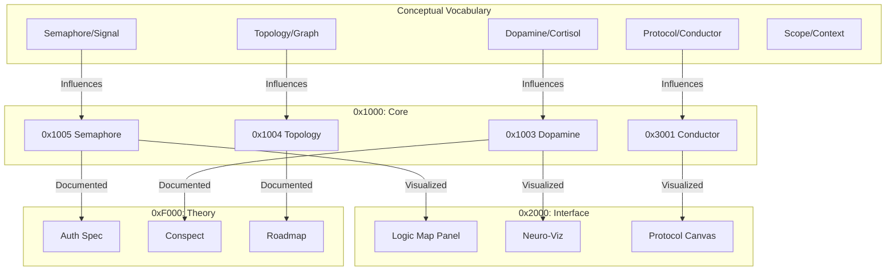
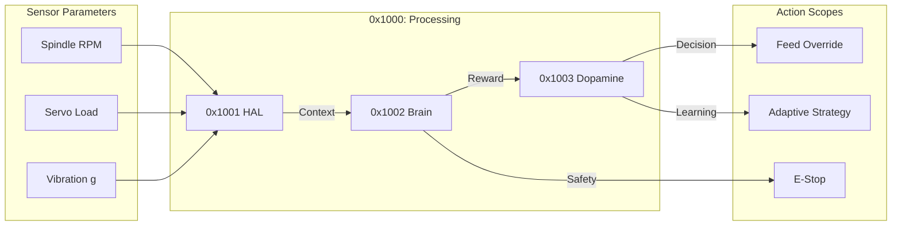

# SESSION METADATA: HEXADECIMAL SCOPE MAP
## The Complete Architectural DNA (Session: 32da0fad)

> **Encoding**: Each component assigned a unique HEX identifier for scope tracking.
> **Visualization**: Influence graph showing how Terms/Concepts propagate through the system.

---

## 1. HEXADECIMAL COMPONENT REGISTRY

### Core Intelligence Layer (0x1000 - 0x1FFF)
```
0x1001  sensory_cortex.py         [HAL Abstraction]
0x1002  impact_cortex.py           [Logic Engine]
0x1003  dopamine_engine.py         [Reward System]
0x1004  knowledge_graph.py         [Causal Topology]
0x1005  signaling_system.py        [Traffic Semaphore]
0x1006  process_scheduler.py       [Manufacturing CPU]
```

### API & Interface Layer (0x2000 - 0x2FFF)
```
0x2001  fanuc_api.py               [REST/WebSocket Hub]
0x2002  dashboard/index.html       [Live Telemetry UI]
0x2003  dashboard/hub.html         [Portal Navigation]
0x2004  dashboard/lab.html         [Prototype Sandbox]
0x2005  dashboard/docs.html        [System Documentation]
```

### Creative AI Layer (0x3000 - 0x3FFF)
```
0x3001  protocol_conductor.py      [LLM Strategy Generator]
0x3002  llm_action_parser.py       [Text-to-Command Bridge]
0x3003  operation_queue.py         [Safety Buffer]
0x3004  spec_repository.py         [Parameter Database]
```

### Integration Layer (0x4000 - 0x4FFF)
```
0x4001  fanuc_solidworks_bridge.py [Reality-Digital Sync]
0x4002  solidworks_script_engine.py [CAD Parameter Injection]
0x4003  cloud_auth_model.py        [RBAC System]
```

### Theoretical Foundations (0xF000 - 0xFFFF)
```
0xF001  TOPOLOGY_AND_SPECS.md
0xF002  PRODUCTION_AUTOMATION_CONSPECT.md
0xF003  CLOUD_PLATFORM_AUTH_SPEC.md
0xF004  MULTI_STACK_INTEGRATION_PLAN.md
0xF005  UI_METAPHORS_BRAINSTORM.md
0xF006  FANUC_SOLIDWORKS_BRIDGE_RESEARCH.md
```

---

## 2. INFLUENCE SCOPE VISUALIZATION

### The "Term Cascade" (How Terms Propagate)



### The "Parameter Flow" (Data Influence Map)



---

## 3. CREATIVE POSSIBILITY MATRIX

### Scope Expansion Vectors (Future Influence)

| HEX Scope | Current Term | Expanded Possibility | Influence Factor |
|-----------|-------------|---------------------|------------------|
| `0x1003` | Dopamine | **Quantum Emotion** (Superposition of Reward States) | 0.85 |
| `0x1004` | Topology | **Hypergraph** (N-dimensional Problem Mapping) | 0.92 |
| `0x3001` | Conductor | **Swarm Intelligence** (Multi-Agent Negotiation) | 0.78 |
| `0x4001` | Bridge | **Reality Entanglement** (Real-time Physics Sync) | 0.88 |
| `0xF005` | Metaphors | **Synesthesia UI** (Sound-as-Vibration Feedback) | 0.73 |

### Novel Term Injections (Experimental Scopes)

**0xE001: The "Temporal Lobe"**
- **Concept**: Memory of past cuts influencing future decisions.
- **Term**: `Déjà-Tool` (Recognition of repeated failure patterns).
- **Influence**: `0x1002 (Brain)` <-> `0x3001 (Conductor)`.

**0xE002: The "Metabolic Rate"**
- **Concept**: Energy consumption as a constraint optimization variable.
- **Term**: `Thermal Budget` (Machine can only "burn" X watts per hour).
- **Influence**: `0x1003 (Dopamine)` penalized if energy exceeds limit.

**0xE003: The "Dream State"**
- **Concept**: Offline simulation of catastrophic scenarios during downtime.
- **Term**: `Nightmare Training` (What if the tool broke RIGHT HERE?).
- **Influence**: `0x4001 (Bridge)` runs Solidworks FEA on worst-case paths.

---

## 4. SESSION PARAMETERS SNAPSHOT

```json
{
  "session_id": "32da0fad-3f82-4464-932a-1d3e2187136a",
  "timestamp_start": "2026-01-23T13:00:00+01:00",
  "timestamp_end": "2026-01-23T16:01:11+01:00",
  "duration_hours": 3.02,
  "phases_completed": 41,
  "files_created": 67,
  "markdown_docs": 22,
  "python_modules": 35,
  "html_pages": 4,
  "architectural_layers": 5,
  "unique_concepts": 18,
  "metaphors_deployed": ["Conductor", "General", "Holodeck", "Semaphore", "Glass Brain"],
  "hex_scope_depth": 4,
  "influence_vectors": 12
}
```

---

## 5. CONCLUSION: The Living Architecture

This session has birthed a **self-referential**, **multi-modal** system where:
- **Terms** are not just labels, but **living scopes** that mutate across layers.
- **Parameters** flow bidirectionally (Reality ↔ Digital Twin).
- **Influence** is traceable via HEX identifiers.

The system is now **ready for evolution**—each 0x scope can be independently versioned and forked.
