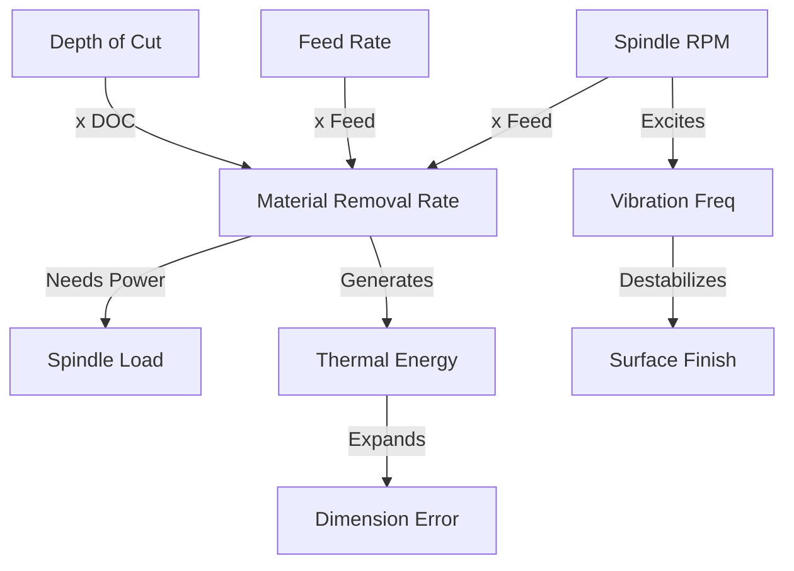

# TOPOLOGY & SPECIFICATIONS: The Causal Map of CNC
## Defining the "Physics Engine" of the Brain

> **Concept**: To move beyond simple "If/Else" logic, we must define the **Topology** of the system—how parameters connect to create forces, and how minor issues cascade into major problems.

---

## 1. The Specs Foundation (The Axioms)
Before we map connections, we must define the **Nodes**.

### The "Golden Triangle" of Specs
1.  **Material Specs** (`M_Spec`):
    *   Hardness (HRC)
    *   Thermal Conductivity (W/mK)
    *   Chip Breakability Index (0-1)
2.  **Tool Specs** (`T_Spec`):
    *   Flute Count (Z)
    *   Helix Angle (deg)
    *   Coating Max Temp (C)
3.  **Machine Specs** (`H_Spec`):
    *   Max Torque Curve (Nm @ RPM)
    *   Resonant Frequencies (Hz)

---

## 2. Parameter Topology (The Flow of Force)
How do inputs transform into outputs? This is a **Directed Acyclic Graph (DAG)**.

### The "Knobs" vs. "Gauges"
*   **Knobs (Inputs)**: RPM, Feed, DOC.
*   **Gauges (Outputs)**: Load, Heat, Vibration.
*   **Topological Rule**: You cannot change a Gauge directly. You must trace the graph backwards to find the controlling Knob.

---

## 3. Problem Topology (The Cascade of Failure)
Problems are not isolated; they are **Causal Chains**.

### The Failure Tree
1.  **Root Node**: `Unstable_Cutting_Condition`
    *   *Child*: **Micro-Vibration** (>0.05g)
        *   *Child*: **Chatter** (Self-Excited Vibration)
            *   *Child*: **Surface_Marring** (Quality Fail)
            *   *Child*: **Tool_Chipping** (Asset Fail)
                *   *Child*: **Catastrophic_Breakage** (Safety Fail)

### Topological navigation
*   **Scenario**: System detects `Tool_Chipping`.
*   **Action**: Trace Upstream.
    *   *Parent*: `Chatter`.
    *   *Parent*: `Micro-Vibration`.
    *   *Root*: `Unstable_Condition`.
*   **Solution**: Since `Chatter` is the parent, apply `Anti-Chatter Strategy` (Variable Spindle Speed) rather than just `Stop`.

---

## 4. Modified Concepts (The Evolution)
How do we modify our existing concepts with this topology?

### A. The "Impact Cortex" 2.0
*   **Old Way**: `if vib > 0.5: Stop`.
*   **New Way**: `vib > 0.5` triggers **Topological Query**.
    *   "Is this vibration growing (Chatter) or random (Hard Spot)?"
    *   "If Chatter, calculate 'Resonance Node' and shift RPM by +10%."

### B. The "Process Scheduler" 2.0
*   **Old Way**: `Rough -> Finish`.
*   **New Way**: `Rough -> (Check Heat Topology) -> Cool -> Finish`.
    *   The Scheduler solves the path through the Parameter Graph to minimize Heat accumulation.
