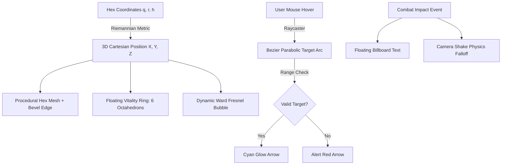

# KRYSTAL-STACK: MASTER GAME COMPOSITION, MAP LEGEND & DISPLAY SYSTEM MANUAL
## Architectural Specification, Procedural Render Pipeline, Fetch Hydration & Race Specializations

**Document Version:** 2.0.0  
**Status:** OFFICIAL MASTER DESIGN MANUAL & LIVING ENGINE SPECIFICATION  
**Target Engines:** Godot 4.x Engine / Three.js WebGL / Python Krystal Engine Core  
**Design Paradigm:** Xiaomi HyperOS 4 / MIUI Fluid Glassmorphism + Poslední Kmen High-Fantasy Strategy  

---

## 1. Executive Architecture & Tripartite Tribal Paradigm

The game world of **Poslední Kmen** is built upon a deterministic, hex-based competitive tactical system where three ancient races vie for dominance over a shattered aéter citadel.

```
┌─────────────────────────────────────────────────────────────────────────────────────────────────┐
│                                   THE TRIPARTITE TRIBAL MATRIX                                  │
├───────────────────────────────┬─────────────────────────────────┬───────────────────────────────┤
│       CRYSTAL TRIBE           │           TOXIC TRIBE           │          DRUID TRIBE          │
│   (Kryštálový Kmeň)           │        (Jedovatý Kmeň)          │        (Druidský Kmeň)        │
├───────────────────────────────┼─────────────────────────────────┼───────────────────────────────┤
│ • Essence: Aéter / Resonance  │ • Essence: Acid / Bio-Miasma    │ • Essence: Nature / Amber Runes│
│ • Hero: Archón (Archon)       │ • Hero: Hnilobník (Defiler)     │ • Hero: Prastarý Šaman (Elder)│
│ • Focus: Shields & Long Range │ • Focus: DoT, Rot & Swarm       │ • Focus: Vital Healing & Roots│
│ • Primary Color: #66fcf1      │ • Primary Color: #39ff14        │ • Primary Color: #ffd700      │
│ • Signature: Ward Bubble      │ • Signature: Acid Pool Hazard   │ • Signature: Grove Sanctuary  │
└───────────────────────────────┴─────────────────────────────────┴───────────────────────────────┘
```

### 1.1 Invariant Axioms
1. **The Hero Vital Invariant ($\text{HP} \in [0, 6]$):**
   The maximum health of any hero unit cannot exceed $6$. Healing actions cap strictly at $6$, and dropping to $0$ immediately triggers tactical collapse.
2. **The Double-Entry Ledger Conservation Law:**
   No resource (Mana, Aether Crystal, Toxic Slime, Amber Rune) may be created or destroyed ex nihilo. Every expenditure debit must have a corresponding credit event in the cryptographic match ledger.
3. **The Axial Metric Spatial Invariant:**
   Distance between any two hex tiles $(q_1, r_1)$ and $(q_2, r_2)$ is defined rigorously by the axial L1-projection metric:
   $$D(H_1, H_2) = \frac{|\Delta q| + |\Delta q + \Delta r| + |\Delta r|}{2}, \quad \text{where } \Delta q = q_1 - q_2, \; \Delta r = r_1 - r_2$$

---

## 2. Tactical Legend Map & Sector Topology

The standard competitive arena features a 19-hex pointy-topped axial grid with variable elevation contours, strategic checkpoint flags, and defense towers.

### 2.1 Arena ASCII Map Layout
```
                          [ 0, -2 ]
                     KRYŠTÁLOVÁ CITADELA
                     (Hráč Základňa / Ward)
                             ▲ h=2.5m
                               │
                          [ 0, -1 ]
                       SEVERNÁ SVÄTYŇA
                      (Vlajka / Kryštály)
                             ▲ h=1.25m
                               │
            [-1, 0]        [ 0,  0 ]        [ 1,  0 ]
        ČADIČOVÉ KRÁTERY   AÉTEROVÝ NEXUS    PRADÁVNY HÁJ
       (Ťažký Terén / Suť) (Centrálna Vlajka) (Krytie / Mana)
            h=0.0m           h=0.0m           h=0.0m
                               │
                          [ 0,  1 ]
                        TOXICKÁ BAŠTA
                      (Vlajka / Kyselina)
                             ▲ h=1.25m
                               │
                          [ 0,  2 ]
                         TOXICKÝ ÚĽ
                    (Nepriateľ Základňa)
                             ▲ h=2.5m
```

### 2.2 Complete Map Legend Specification

| Symbol | Sektor & Názov | Hex $(q, r)$ | Výška ($h$) | Typ Terénu & Náklad MP | Taktický Efekt & Pravidlá |
| :---: | :--- | :---: | :---: | :---: | :--- |
| 🏰 | **Kryštálová Citadela** | `[0, -2]` | $2.5\text{ m}$ | Fortified Pylon (1.0 MP) | Základňa hráča. Ward štít (6 HP absorpcia, +2 regen). Bod oživenia. |
| 💎 | **Severná Svätyňa** | `[0, -1]` | $1.25\text{ m}$ | Crystal Shards (1.5 MP) | Predsunutá vlajka (1 VP/kolo). +1 Range strelcom na stred. Zranenie pri vstupe 1 HP na hod 1 (D6). |
| ⚑ | **Aéterový Nexus** | `[0, 0]` | $0.0\text{ m}$ | Clear Terrain (1.0 MP) | Centrálny checkpoint. 2 VP/kolo. Kľúčový spojovací uzol pre Line of Supply. |
| ☣️ | **Toxická Bašta** | `[0, 1]` | $1.25\text{ m}$ | Toxic Mire (2.0 MP) | Predsunutá vlajka (1 VP/kolo). Nebezpečný terén: test nebezpečenstva pri vstupe. |
| 🌋 | **Toxický Úľ** | `[0, 2]` | $2.5\text{ m}$ | Acid Spire (1.0 MP) | Základňa nepriateľa. Inštalovaná kyselinová veža s priamou paľbou. |
| 🌑 | **Čadičové Krátery** | `[-1, 0]` | $0.0\text{ m}$ | Crater Rubble (1.5 MP) | Ťažký terén. Krytie v kráteri poskytuje $+1$ k Armor Save. |
| 🌳 | **Pradávny Háj** | `[1, 0]` | $0.0\text{ m}$ | Ancient Roots (1.5 MP) | Lesný terén. Druidské jednotky tu získavajú $+1$ Manu pri začatí ťahu. |

### 2.3 Taktické Prekrytia (Tactical Overlays)
1. **Line of Supply (Zásobovacia Línia - LoS):**
   - Vykresľuje sa ako pulzujúci cyanový lúč spájajúci domovskú základňu s kontrolovanými checkpointmi.
   - Overované pomocou BFS grafového algoritmu: ak nepriateľská jednotka obsadí spojovací hex a preruší líniu, checkpoint prestáva generovať VP a stráca funkciu bodu pre respawn.
2. **Zone of Control (Zóna Kontroly - ZoC):**
   - Rádius 1 hex okolo každej vlajky.
   - Prítomnosť jednotiek oboch strán vyvoláva stav `CONTESTED` (sporný), čím sa zmrazuje získavanie bodov.
3. **Tower Ward Bubble (Wardové Silové Pole):**
   - Polomer $1.65\text{ m}$ okolo základňových veží.
   - Pohlcuje poškodenie pred zásahom do zdravia hrdinu.
   - Plynulá dýchajúca oscilácia veľkosti: $S(t) = 1.0 + 0.035\sin(2t)$.

---

## 3. Procedurálny Render a Zobrazovací Systém

Renderovací systém spája výkon WebGL (Three.js r128) a formát scén Godot 4.x (.tscn) s dizajnovým jazykom Xiaomi HyperOS 4.



### 3.1 Komponenty 3D Viewportu
1. **Fazetované Hexagonálne Dlaždice:**
   - Výška $0.45\text{ m}$, polomer $0.92\text{ m}$, rotácia $30^\circ$ (pointy-topped).
   - Procedurálne PBR materiály: `MeshStandardMaterial` s metalicitou $0.2$, hrubosťou $0.3$ a emissívnym obrysom.
2. **Plávajúci 6-Segmentový Vitality Ring:**
   - Výška $y = 2.05\text{ m}$ nad hlavou hrdinu.
   - 6 symetricky rotujúcich oktaédrov ($r = 0.65\text{ m}$).
   - Živé HP: Cyanová/zelená žiara (emissive intensity $1.0$).
   - Stratené HP: Zhasnutý tmavý čadič (scale $0.45$, emissive $0.05$).
3. **Bézierov Parabolický Zameriavací Oblúk:**
   - Kvadratická Bézierova krivka v 3D priestore:
     $$\mathbf{B}(t) = (1-t)^2 \mathbf{P}_{\text{start}} + 2(1-t)t \mathbf{P}_{\text{apex}} + t^2 \mathbf{P}_{\text{target}}$$
   - $\mathbf{P}_{\text{apex}} = \frac{\mathbf{P}_{\text{start}} + \mathbf{P}_{\text{target}}}{2} + (0, h_{\text{apex}}, 0)$, kde $h_{\text{apex}} = \max(2.0, \text{dist} \times 0.65)$.
   - Real-time validácia dosahu s farebným kódom: Cyan (platný dosah), Červená (mimo dosah), Žltá (self-buff).
4. **Plávajúci Bojový Text & Otrasy Kamery:**
   - Screen-space billboard projekcia: $\mathbf{P}_{\text{screen}} = \text{Project}(\mathbf{P}_{\text{world}}, \mathbf{M}_{\text{cam}})$.
   - Parabolický vzostup $v_y = 1.8\text{ px/frame}$, fade-out $1.4\text{ s}$.
   - Otrasy kamery s exponenciálnym útlmom $A(t) = A_0 e^{-\lambda t}$.

---

## 4. Architektúra Získavania Závislostí (Fetch Dependencies)

Systém zaručuje **100% offline air-gapped funkčnosť** pre lokálny vývoj a automatický fallback na CDN.

```
┌────────────────────────────────────────────────────────────────────────┐
│               DUAL-LAYER DEPENDENCY & ASSET HYDRATION                 │
├────────────────────────────────────────────────────────────────────────┤
│ 1. LOCAL CHECK:  Fetch /static/vendor/three.min.js (603 KB)            │
│                  Fetch /static/vendor/OrbitControls.js (26 KB)         │
│                  ──► If Available: Instant Bootstrap (Offline Mode)    │
│                                                                        │
│ 2. CDN FALLBACK: Fetch cdnjs.cloudflare.com/three.js (r128)           │
│                  Fetch cdn.jsdelivr.net/OrbitControls.js               │
│                  ──► If Local Missing: Seamless Cloud Fallback         │
│                                                                        │
│ 3. VERIFICATION: Verify window.THREE & window.THREE.OrbitControls      │
│                  Emit 'krystal:dependencies-ready' Event               │
│                                                                        │
│ 4. HYDRATION:    GET /api/game/match-state  (Full Match Snapshot)      │
│                  GET /api/game/content-catalog (129 Cards, 9 Units)    │
│                  GET /api/assets/manifest  (Procedural Assets Map)     │
└────────────────────────────────────────────────────────────────────────┘
```

### 4.1 REST API Endpointy pre Hydratáciu Dát (Port 8089)
- `GET /api/assets/manifest`: Vráti zoznam procedurálnych assetov, zvukov a status `HEALTHY_OFFLINE_READY`.
- `GET /api/game/content-catalog`: Kompletná databáza 129 kariet, 9 archetypov jednotiek, crafting šablón, afixov a sektorov.
- `GET /api/game/match-state`: Jedno-požiadavkový snapshot celého stavu zápasu pre okamžitú synchronizáciu klienta.
- `GET /api/game/races`: Vráti kompletné dáta o rasách, triedach a talentových špecializáciách.
- `GET /api/game/legend-map`: Vráti topológiu arény, sektory, výšky a taktické prekrytia.

---

## 5. Rozdiely Rás, Triedy Hrdinov a Špecializácie

### 5.1 Prehľadová Porovnávacia Matica Šampiónov (Warhammer Statblock)

| Atribút | Kryštálový Archón | Toxický Hnilobník | Prastarý Šaman |
| :--- | :---: | :---: | :---: |
| **Kmeň / Rasa** | Kryštálový (Aéter) | Jedovatý (Kyselina) | Druidský (Príroda) |
| **Pohyb ($M$)** | $2\text{ hex}$ | $2\text{ hex}$ | $2\text{ hex}$ |
| **Weapon Skill ($WS$)** | **3+** | **3+** | **4+** |
| **Ballistic Skill ($BS$)** | **2+** (Najvyššia presnosť) | **3+** | **3+** |
| **Sila ($S$)** | 4 | 4 | 3 |
| **Odolnosť ($T$)** | 4 | **5** (Najvyššia odolnosť) | 4 |
| **Životy ($W$)** | **6 Max** (Axiom) | **6 Max** (Axiom) | **6 Max** (Axiom) |
| **Útoky ($A$)** | 3 | **4** (Vysoká kadencia) | 2 |
| **Morálka ($Ld$)** | 8 | 7 | **9** (Najvyššia vôľa) |
| **Brnenie ($Sv$)** | **3+** | 4+ | **3+** |
| **Nezraniteľný Štít ($Invuln$)** | 5+ | 5+ | **4+** (Najsilnejší štít) |
| **Rasová Pasívka** | Aéterové Odpudenie (+1 Sv diaľka) | Žieravá Koža (-1 brnenie útočníka) | Fotosyntéza (+1 Mana na lese) |

---

### 5.2 Detailné Vetvy Špecializácií

#### 1. KRYŠTÁLOVÝ ARCHÓN (Archon)
*Filozofia:* Geometrická dokonalosť, manipulácia aéterom a kinetické štíty.
- **Špecializácia A: Pylónový Rezonátor (Resonance Pylonist)**
  - *Rola:* Ranged Support & Siege Artillery.
  - *Pasívna schopnosť:* **Harmonická Sieť** – zvyšuje dosah veží o $+1$ a silu ich Ward štítu o $+2$.
  - *Signatúrna akcia:* **Orbitálna Hyperkopija** (Cena 5 Many, 2 Kryštály, dosah 1-5, poškodenie 4, AP -2).
  - *Zbraňová afinita:* Kryštálová Čepeľ & Aéterový Žiarič.
- **Špecializácia B: Mrazivý Paladin (Frost Paladin)**
  - *Rola:* Frontline Melee Juggernaut.
  - *Pasívna schopnosť:* **Glaciálny Obal** – odrazí 1 bod poškodenia útočníkovi pri každom úspešnom Armor Save v melee.
  - *Signatúrna akcia:* **Trieštivá Rezonancia** (Cena 3 Many, melee, zničí 2 body nepriateľského brnenia, udelí 2 DMG).
  - *Zbraňová afinita:* Čadičová Pavéza & Rezonančný Meč.

#### 2. TOXICKÝ HNILOBNÍK (Defiler)
*Filozofia:* Biologický rozklad, korózia nepriateľskej výbavy a masový roj.
- **Špecializácia A: Žieravý Alchymista (Corrosive Alchemist)**
  - *Rola:* Area Denial & Armor Melter.
  - *Pasívna schopnosť:* **Permanentná Miazma** – kyselinové útoky vytvárajú na 2 kolá nebezpečný terén s nákladom 2.0 MP.
  - *Signatúrna akcia:* **Kyselinová Kataklizma** (Cena 5 Many, 2 Slizy, AoE, rozpustí 4 brnenia a udelí 2 plošné DMG).
  - *Zbraňová afinita:* Toxická Kadidelnica & Žieravá Dýka.
- **Špecializácia B: Rojový Parazit (Brood Parasite)**
  - *Rola:* Swarmlord & Vampire Striker.
  - *Pasívna schopnosť:* **Vysatie Života** – každý úder za 2+ poškodenia zregeneruje hrdinovi $+1$ HP (do 6 Max HP).
  - *Signatúrna akcia:* **Prebudenie Ohavnosti** (Cena 6 Many, 3 Slizy, melee, 4 brutálne DMG, aplikuje nákazu).
  - *Zbraňová afinita:* Zuby Rozkladu & Zámotok Slizu.

#### 3. PRASTARÝ ŠAMAN (Elder)
*Filozofia:* Prepojenie so silami Zeme, liečenie buniek a privolávanie zvieracích strážcov.
- **Špecializácia A: Životodarný Liečiteľ (Verdant Healer)**
  - *Rola:* Vital Renewal & Fortress Protector.
  - *Pasívna schopnosť:* **Prírodná Regenerácia** – pasívne vylieči $+1$ HP každé 2 kolá (prísne limitované 6 Max HP).
  - *Signatúrna akcia:* **Svätyňa Hája** (Cena 3 Many, plošné liečenie $+2$ HP a $+2$ Brnenia všetkým spojencom).
  - *Zbraňová afinita:* Druidská Palica & Jantárový Talizman.
- **Špecializácia B: Pán Zvierat & Menič (Beastcaller / Wildshaper)**
  - *Rola:* Summoner & Wild Shaper.
  - *Pasívna schopnosť:* **Vlčia Svorka** – privolaní Duchovní Vlci získavajú $+1$ Útok a schopnosť Fights First.
  - *Signatúrna akcia:* **Avatar Hvozdu** (Cena 5 Many, 2 Jantáry, transformácia: $+2$ HP, $+2$ Brnenie, Fights First a $+2$ Útoky).
  - *Zbraňová afinita:* Dubová Palica & Runová Čepeľ.

---

## 6. Súvisiace Herné Mechaniky

1. **Warhammer Pravidlá Pohyblivosti:**
   - **Normal Move ($M$):** Pohyb do vzdialenosti $M$, jednotka môže strieľať a ohlásiť Charge.
   - **Advance ($M + \text{D6}$):** Šprint o bonusové hexové polia; stráca možnosť útoku a Charge.
   - **Charge ($2\text{D6}$):** Nájazd do vzdialenosti 6 hexov. Ak $2\text{D6} \ge 2 \times \text{vzdialenosť}$, jednotka vtrhne do priľahlého hexu a získava **Fights First**.
   - **Fall Back:** Ústup zo zóny ohrozenia bez možnosti streľby v danom kole.
2. **Lokačná 3D Hex Algebra:**
   - Streľba zhora ($\Delta h \ge 1.5\text{ m}$): $+2$ Dosah, $+1$ Zásah, $+1$ AP, $+50\%$ Poškodenie.
   - Útok zdola nahor ($\Delta h \le -1.5\text{ m}$): $-2$ Dosah, $-1$ Zásah, Krytie veže $+2$ Save, $-25\%$ Poškodenie.
3. **Modulárny Crafting s Limitmi:**
   - Stropy počtu afixov podľa vzácnosti (Common 0 až Legendary 5).
   - Elementárna neznášanlivosť: Kryštál + Toxický bez Jantárového katalyzátora vyvolá `CraftingInstabilityError`.
   - Viazanosť na podvojný účtovný systém bez nekrytých debetov.
