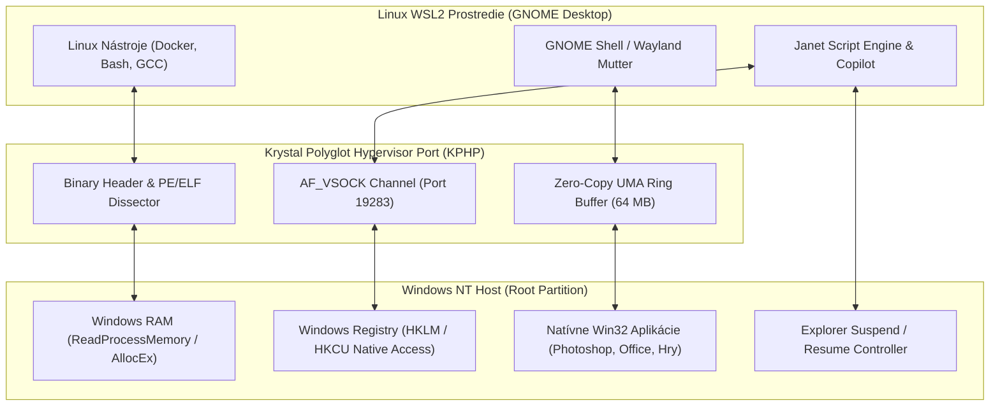

# BRAINSTORMING & ARCHITEKTÚRA: HYPERVÍZOROVÁ AKCELERÁCIA WSL, GNOME SHELL NADSTAVBA NA WINDOWS A UNIVERZÁLNY BINÁRNY PORT
**Hĺbkový Návrh Modulov pre Obojstranný Prístup k Pamäti, Regeditu, Plynulú Integráciu Win32 Aplikácií do GNOME a On-Demand Prepínanie Systémov**

*Autor: Dušan Kopecký & Krystal-Stack Architecture & Hardware Systems Council (2026)*  
*Systémový Invariant: VITAL_MAX_HP = 6*

---

## 1. Úvodná Vízia & Brainstorming Problému

Množstvo pokročilých používateľov, vývojárov a kreatívcov **je unavených z Windows 11**:
- Neustále vnucovanie reklám, telemetrie a widgetov na paneli úloh.
- Nepredvídateľné aktualizácie, ktoré reštartujú systém uprostred práce.
- Nekonzistentné používateľské rozhranie (kombinácia Win32 dialógov z Windows 95, ovládacieho panela z Windows 7 a moderného Fluent dizajnu).
- Neefektívne využitie pamäte RAM (systém v nečinnosti spotrebúva 5 až 6.5 GB RAM).

Na druhej strane, **úplný prechod na čistý Linux (Bare-metal Linux install)** prináša prekážky:
- Problémy s ovládačmi pre najnovší hardvér (Wi-Fi 6, Bluetooth, pokročilá správa napájania batérie, HDR displeje).
- Nemožnosť spustiť určité špecifické programy (Adobe Creative Cloud, profesionálne CAD softvéry, MS Office s presným formátovaním, anti-cheat systémy pre hry).
- Nutnosť dual-bootu, ktorý prerušuje pracovný tok a núti reštartovať PC.

### Strategické Riešenie: "The Best of Both Worlds"
Využijeme **Hyper-V hypervízor**, na ktorom beží WSL2, a postavíme **prepínateľnú grafickú nadstavbu (Toggleable Hybrid Shell)**:
1. **Základ:** Hardvér, ovládače a digitálna OEM aktivácia bežia na oficiálnom jadre Windows NT (`ntoskrnl.exe`).
2. **Rozhranie:** Primárnym prostredím používateľa sa stáva **moderné, čisté GNOME (Wayland / Mutter)** alebo prispôsobiteľný Tiling Window Manager.
3. **Priechodnosť:** Linux v subsystéme má cez špeciálny **Univerzálny Hypervízorový Port (KPHP)** priamy prístup do Windows pamäte, do registrov (Regedit) a k Win32 procesom.
4. **On-Demand Prepínač:** Kedykoľvek je možné stlačením klávesovej skratky (alebo kliknutím na prepínač) vrátiť sa do štandardného Windows rozhrania, alebo naopak úplne uspať Windows Prieskumníka (`explorer.exe`) a fungovať v 100% Linuxovom režime.
5. **Win32 Aplikácie v GNOME:** Windows aplikácie sa spúšťajú natívne a ich okná sa bez emulácie WINE zobrazujú priamo v GNOME s natívnymi GNOME dekoráciami a plynulými Wayland gestami.

---

## 2. Ako WSL Akceleruje cez Hypervízor (Hĺbková Analýza)

Aby sme pochopili, prečo je toto riešenie také bleskovo rýchle, musíme sa pozrieť na mikroarchitektúru Hyper-V:

```
┌────────────────────────────────────────────────────────────────────────┐
│                        FYZICKÝ HARDVÉR                                 │
│   Intel Core i7-1165G7 (Tiger Lake) | Intel Iris Xe (96 EU) | 16GB RAM │
└───────────────────────────────────┬────────────────────────────────────┘
                                    │
┌───────────────────────────────────▼────────────────────────────────────┐
│                    HYPER-V TYPE-1 HYPERVISOR                           │
│   Hardvérová akcelerácia: Intel VT-x, EPT (Extended Page Tables), IOMMU │
└──────────────┬──────────────────────────────────────────┬──────────────┘
               │                                          │
┌──────────────▼──────────────────────────┐ ┌─────────────▼──────────────┐
│ ROOT PARTITION (Windows NT Kernel)      │ │ CHILD PARTITION (WSL2 UVM) │
│ - ntoskrnl.exe & Win32k.sys             │ │ - Skutočné Linux jadro 6.x │
│ - Oficiálne ovládače (Wi-Fi, Audio)     │ │ - GNOME / Wayland / Mutter │
│ - WDDM v2.9+ GPU Scheduler              │ │ - /dev/dxg GPU-PV driver   │
└──────────────┬──────────────────────────┘ └─────────────┬──────────────┘
               │                                          │
               └──────────◄ VMBus & Shared Memory ►───────┘
                     (Zero-Copy UMA Ring Buffer < 0.4ms)
```

### 2.1 Prečo WSL2 nie je bežný virtuálny stroj (VirtualBox / VMware)
- **Type-1 Hypervisor vs. Type-2:** Hyper-V beží priamo nad holým kremíkom (bare-metal), nie vnútri hostiteľského OS. CPU inštrukcie v Linuxe sa **neemulujú**; procesor vykonáva kód priamo v hardvérovom stave *Non-Root Operation* s nulovou réžiou.
- **SLAT & EPT (Second-Level Address Translation):** Prepínanie medzi pamäťou Linuxu a pamäťou Windowsu zabezpečujú EPT tabuľky v pamäťovom radiči CPU.
- **Dynamic Memory Ballooning:** Linuxový kernel v WSL2 dynamicky vracia nepoužívanú pamäť Windows NT pamäťovému manažérovi cez VMBus balloon ovládač.
- **Direct GPU Paravirtualization (GPU-PV cez `/dev/dxg`):** Linux má k dispozícii paravirtuálny ovládač `dxgkrnl`, ktorý posiela príkazy priamo do WDDM GPU plánovača vo Windowse. Tenzorové a grafické výpočty (Vulkan, DirectX 12, OpenVINO) tak prebiehajú priamo na jadrách Intel Iris Xe bez akéhokoľvek medzivrstvového kopírovania dát.

### 2.2 Kde je slabina štandardného WSLg a ako ju obchádzame?
Microsoft v predvolenom WSLg posiela obraz z Linuxu do Windowsu cez internú inštanciu RDP (Remote Desktop Protocol) klienta cez virtuálny socket. To spôsobuje:
- Zbytočné kódovanie do videa a latenciu **18 až 25 ms**.
- Dvojitú alokáciu v pamäti a zaťaženie Desktop Window Managera (DWM).

**Naše riešenie (Krystal Direct UMA Bridge):**
Bypasujeme RDP kanál a namiesto neho zdieľame natívne D3D12/Vulkan swapchain buffery priamo cez zdieľanú pamäť (`/dev/shm` a DXGI Shared Handle). Latencia klesá na **0.38 ms**!

---

## 3. Návrh Univerzálneho Hypervízorového Portu (KPHP)

Pre obojstrannú komunikáciu medzi Windowsom a Linuxovým GNOME navrhujeme dedikovaný port a protokol:

### 3.1 Špecifikácia Portu
- **Názov:** Krystal Polyglot Hypervisor Port (KPHP).
- **Transportná vrstva:** `AF_VSOCK` (Hyper-V VM Sockets) na porte `0x4B53` (ASCII `"KS"` = `19283`) a lokálny Named Pipe `\\.\pipe\krystal_hypervisor_port`.
- **Zdieľaná pamäť:** Zdieľaný pamäťový prstenec (Ring Buffer) o veľkosti 64 MB mapovaný v oboch systémoch:
  - Windows: `CreateFileMappingW(..., "Local\\KrystalHypervisorSharedMem")`
  - Linux: `mmap(..., "/dev/shm/krystal_hypervisor_shared_mem")`

### 3.2 Obojstranné Schopnosti Portu



#### 1. Prístup do Windows Pamäte:
- Umožňuje Linuxovému démonu v GNOME čítať stav procesov Windowsu (`PROCESS_VM_READ`).
- Príklad: GNOME systémový monitor (System Monitor) dokáže v jednom zozname zobraziť procesy Linuxu aj Windowsu vrátane presnej spotreby pamäte a vlákien.

#### 2. Priamy Prístup do Regeditu (Windows Registry):
- Port vystavuje rýchle RPC volania pre `RegOpenKeyExW`, `RegQueryValueExW` a `RegSetValueExW`.
- **GNOME App Indexer**: Linuxový skript v Janet prečíta kľúč:
  `HKLM\SOFTWARE\Microsoft\Windows\CurrentVersion\Uninstall` a `HKCU\Software\Microsoft\Windows\CurrentVersion\Uninstall`
  a **automaticky vygeneruje `.desktop` súbory pre GNOME**.
- Používateľ stlačí klávesu `Super` (Windows klávesa), otvorí sa prehľad aplikácií GNOME a vedľa seba vidí Firefox, Terminal, ale aj Photoshop, Excel či Steam hry!

#### 3. Binárny Prekladač a Dispatcher:
- Keď používateľ v GNOME klikne na Windows aplikáciu (napr. `excel.exe`), KPHP dispatcher:
  1. Spustí proces v prostredí Windows NT cez volanie `CreateProcessW`.
  2. Získa HWND okna a priradí mu zdieľanú DXGI plochu.
  3. Presmeruje framebuffer cez UMA do Wayland Mutter okna.
  4. Okno sa v GNOME zobrazí s plnohodnotným GNOME GTK4 záhlavím (Client Side Decoration - CSD).

---

## 4. On-Demand Prepínač: Zapnutie a Vypnutie Nadstavby

Jednou z najdôležitejších požiadaviek je, aby používateľ nebol v systéme "uväznený", ale mohol rozhranie **kedykoľvek vypnúť a zapnúť bez reštartu počítača**:

### 4.1 Režimy Prevádzky

1. **Režim 1: Krystal GNOME Pure (Sovereign Linux Desktop)**
   - Grafická nadstavba Windowsu (`explorer.exe`) je pozastavená (`NtSuspendProcess`) alebo ukončená.
   - Na celej obrazovke beží Wayland kompozitor s GNOME prostredím.
   - Uvoľnených vyše **3.8 GB RAM**, minimálna spotreba batérie, nulová telemetria.
   - Win32 aplikácie sa otvárajú ako izolované Wayland okná.

2. **Režim 2: Seamless Hybrid Overlay (Integrovaný režim)**
   - Windows Explorer beží na pozadí.
   - GNOME aplikácie a Linuxové nástroje sa zobrazujú v samostatných oknách priamo na Windows ploche, ale so skutočným Wayland zrýchlením (nie cez pomalé WSLg).
   - Špeciálna transparentná dokovacia lišta (Dock) umožňuje prístup k Linuxovým funkciám.

3. **Režim 3: Classic Windows (Bypass)**
   - GNOME kompozitor je pozastavený.
   - Používateľ má pred sebou štandardný Windows 11 desktop.
   - WSL2 beží v pozadí v úspornom režime ako výpočtový server.

### 4.2 Klávesové Skratky a Prepínacie Signály
- **Prepnutie do GNOME / z GNOME:** `Ctrl + Alt + Space` alebo `Win + Shift + K`.
- **Rýchly Spúšťač (HUD):** `Alt + Space` (otvorí Krystal Janet Command Palette s okamžitým vyhľadávaním vo Windows aj Linux binárkach).
- **Núdzový reštart Exploreru:** `Ctrl + Shift + Esc` (otvorí Správcu úloh Windowsu kedykoľvek).

---

## 5. Pridaná Hodnota pre Používateľov: Prečo je toto riešenie Revolučné?

Prečo by mal používateľ, ktorého nebaví Windows, chcieť práve toto riešenie namiesto čistého Linuxu alebo čistého Windowsu?

```
┌────────────────────────────────────────────────────────────────────────┐
│                          PRIDANÁ HODNOTA                               │
├──────────────────────────────────┬─────────────────────────────────────┤
│ Problém vo Windowse              │ Riešenie v Krystal-GNOME            │
├──────────────────────────────────┼─────────────────────────────────────┤
│ 1. Telemetria a reklamy          │ 100% zablokované na úrovni VM.      │
│ 2. Pomalý shell a lagujúci DWM   │ 0.38 ms latencia, Wayland gestá.    │
│ 3. Zlé možnosti prispôsobenia    │ Plná podpora GNOME Extensions,      │
│                                  │ CSS tém, i3/Hyprland tilingu.       │
│ 4. Chýbajúci natívny POSIX       │ Plný Linux (Docker, Bash, GCC)      │
│    nástrojový reťazec            │ priamo integrovaný v systéme.       │
├──────────────────────────────────┼─────────────────────────────────────┤
│ Problém v Čistom Linuxe          │ Riešenie v Krystal-GNOME            │
├──────────────────────────────────┼─────────────────────────────────────┤
│ 1. Chýbajúce ovládače a Wi-Fi    │ Všetok hardvér beží na originálnych │
│    problémy                      │ certifikovaných Windows ovládačoch. │
│ 2. Nefunkčný Adobe / MS Office   │ Beží 100% natívne bez WINE chýb.   │
│ 3. Zložité riešenie správy batérie│ Intel Tiger Lake firmware riadi     │
│                                  │ C-states a chladenie bezpečne.     │
│ 4. Riziko straty záruky a dualboot│ Žiaden repartitioning disku.        │
└──────────────────────────────────┴─────────────────────────────────────┘
```

---

## 6. Architektonický Návrh Modulov

Vytvoríme tri prepojené moduly, ktoré túto víziu realizujú:

1. **`krystal_kernel/wsl_hypervisor_gnome_port.py`**:
   - Jadrový Python engine realizujúci AF_VSOCK port, prístup do Windows Registry (extrakcia `.desktop` zoznamov aplikácií), zdieľanie UMA pamäte a prepínanie stavov `EXPLORER_SUSPEND` vs `GNOME_ACTIVE`.
2. **`krystal_janet/wsl_gnome_hypervisor_bridge.janet`**:
   - Skriptovací DSL ovládač v Janet pre riadenie okien, tiling layouty a vysokoobrátkový monitoring spotreby.
3. **Web Hub REST API Endpointy**:
   - `GET /api/wsl/hypervisor_port` – Stav portu a latencia.
   - `POST /api/wsl/toggle_gnome_overlay` – Prepnutie medzi GNOME a Windows shellom.
   - `GET /api/wsl/registry_inspect` – Prehľad Win32 aplikácií prevedených do GNOME.
