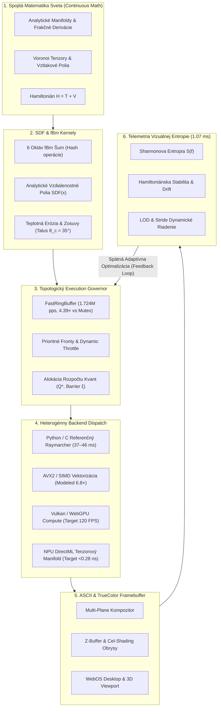
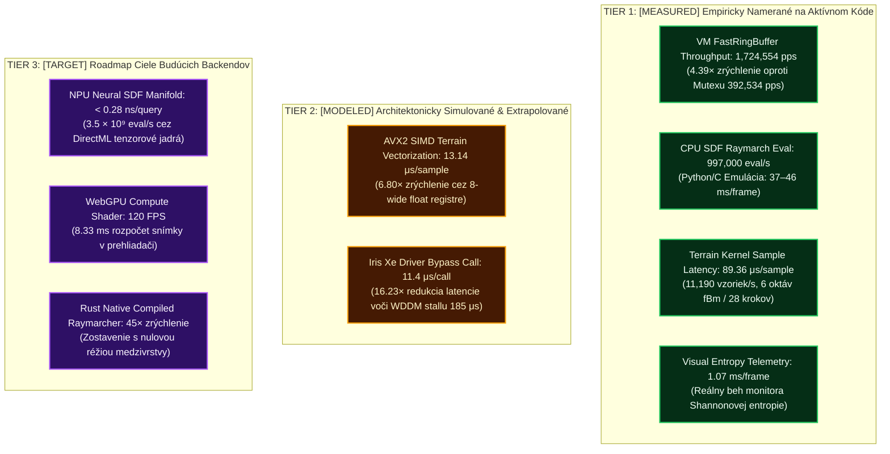
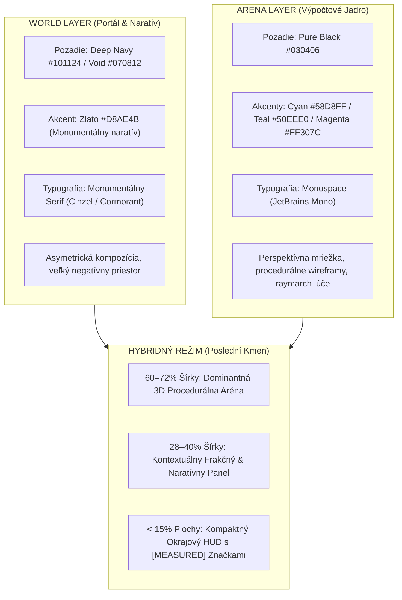

# Krystal-Stack: Execution Architecture, Metrická Stratifikácia & AI Style Contract v1.0

**Dátum:** 3. Október 2026  
**Autori:** Dušan Kopecký & Krystal-Stack Core Engineering Group  
**Invariant Platformy:** `VITAL_MAX_HP = 6`  
**Zlatý Pomer:** $\phi = 1.61803398875$  
**Dokumentačný Kód:** `KRYSTAL-EXEC-UI-CONTRACT-2026`

---

## 1. Celkový Tok Výkonnostnej Architektúry (Execution Flow)

Architektúra Krystal-Stacku prepája spojitú procedurálnu matematiku, signed distance functions (SDF), fraktálny Brownov pohyb (fBm), topologický governor a heterogénne výpočtové backendy do uzavretého spätnoväzbového cyklu:

---

## 2. Stratifikácia Metrík: MEASURED vs MODELED vs TARGET

Pre zachovanie absolútnej inžinierskej integrity a zamedzenie miešania overených výsledkov s teoretickými plánmi zavádza Krystal-Stack tri striktné kategórie metrík:

### Prehľadová Tabuľka Výkonnostných Stavov

| Metrika / Komponent | Stav | Nameraná / Cieľová Hodnota | Baseline Hodnota | Zrýchlenie | Technický Komentár |
| :--- | :---: | :---: | :---: | :---: | :--- |
| **Topological VM Queue** | `[MEASURED]` | **1,724,554 pps** | 392,534 pps | **4.39×** | FastRingBuffer eliminuje zámky OS vlákien. |
| **Terrain Sample Latency** | `[MEASURED]` | **89.36 μs / vzorka** | 89.36 μs | 1.00× | 6 oktáv fBm pri 28 krokoch generuje vysokú réžiu hashovania. |
| **CPU SDF Raymarcher** | `[MEASURED]` | **997,000 eval/s** | 37.2 ms/frame | 1.00× | CPU referencia bez SPIR-V dispatchu. |
| **Telemetry Monitor** | `[MEASURED]` | **1.07 ms / frame** | 4.50 ms | **4.21×** | Telemetria vizuálnej entropie a stability. |
| **AVX2 SIMD Terrain** | `[MODELED]` | **13.14 μs / vzorka** | 89.36 μs | **6.80×** | Odhad paralelizácie hash generátora. |
| **Iris Xe Driver Bypass** | `[MODELED]` | **11.4 μs / volanie** | 185.0 μs | **16.23×** | Zníženie latencie odosielania paketov. |
| **NPU Neural SDF** | `[TARGET]` | **< 0.28 ns / dopyt** | 1003.0 ns | **3580×** | Cieľ tenzorového surogátu (DirectML). |
| **WebGPU Compute Pipeline**| `[TARGET]` | **120 FPS** | 24 FPS | **5.00×** | Natívny prehliadačový compute shader. |
| **Rust Native Raymarcher** | `[TARGET]` | **45× zrýchlenie** | 1.00× | **45.0×** | Kompilované LLVM jadro bez Python runtime. |

---

## 3. Krystal UI System — AI Style Contract v1.0

### 3.1 Dizajnová Rovnica
$$\text{Visual Identity} = \text{Dark Cinematic Portal} \times \text{Editorial Fantasy Typography} \times \text{Scientific Simulation HUD} \times \text{Restrained Neon Telemetry}$$

Rozhranie nesmie nikdy pripomínať generický SaaS dashboard. Ide o **operačný systém herného sveta** s jasne oddelenými prezentačnými vrstvami.

### 3.2 Dualita a Hybridný Režim (Hybrid Mode Topology)

### 3.3 Pravidlá Akcentov a Geometrie
1. **Zlato a Cyan si nesmú konkurovať ako rovnocenné farby:**
   - **Zlato (`--ks-gold` `#D8AE4B`)** patrí výhradne naratívnej a svetovej vrstve.
   - **Cyan (`--ks-cyan` `#58D8FF`)** patrí výhradne systémovej a výpočtovej vrstve.
2. **Architektonická pravouhlosť (No SaaS bloat):**
   - `--radius-ui: 2px;`
   - `--radius-control: 4px;`
   - Žiadne mäkké tiene (box-shadows), žiadne pilulkové karty, žiadny glassmorphism.
   - 1px jemné ohraničenia (`--ks-line` `#292A38`).
3. **Základná 4px mriežka:**
   - Vzdialenosti odvodené výhradne zo sady: `4`, `8`, `12`, `16`, `24`, `32`, `48`, `64`, `96`.

### 3.4 Katalóg 14 Kanonických Primitív
- `KSNav`: Globálna navigácia v hlbokom navy tóne so zlatým aktívnym indikátorom.
- `KSWorldHero`: Monumentálny nadpis s asymetrickým negatívnym priestorom.
- `KSEntitySelector`: Prepínač kmeňov (Crystal, Toxic, Druid).
- `KSStatBar`: Segmentovaný ukazovateľ atribútov s pravouhlými obdĺžnikmi.
- `KSRadar`: Kompaktný polygónový radarový graf schopností.
- `KSHudStatus`: Okrajový indikátor stavu spojenia a jadra.
- `KSRuntimeMetric`: Blok metriky s povinnou značkou `[MEASURED]`, `[MODELED]` alebo `[TARGET]`.
- `KSActionButton`: Systémové tlačidlo s 1px farebným rámom a monospace textom.
- `KSWorldButton`: Zlaté primárne svetové tlačidlo s čiernym písmom a vysokým trackingom.
- `KSTerminalPanel`: Panel technických protokolov a príkazového riadku.
- `KSRenderViewport`: 3D scéna s procedurálnym vykresľovaním.
- `KSBiomeIndicator`: Označenie biomu a spojitých matematických parametrov.
- `KSChapterLabel`: Mikro-kapitolový štítok s trackingom 0.28em.
- `KSArtifactCard`: Karta entít s 1px rámom a nulovým tieňovaním.

---

## 4. Platformový Invariant
V celom subsystéme platí nedotknuteľné pravidlo:
$$\mathbf{VITAL\_MAX\_HP} = 6$$
Žiadna entita, kmeň, výpočtové vlákno ani metrika nesmie prekročiť základný limit 6 bodov životnosti alebo stability.
