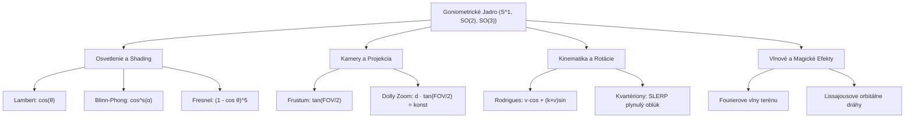

# GONIOMETRIA A TRIGONOMETRICKÉ FUNKCIE AKO ONTOLOGICKÝ NÁSTROJ GRAFICKÉHO SPRACOVANIA A VIZUÁLNEHO POROZUMENIA
**Výskumná štúdia a architektonický traktát o vizualizácii uhlov, fáz a vlnových oscilácií v herných enginoch**
*Krystal-Stack Platform Framework // Research Division*
*Dátum: Október 2026*

---

## 1. Výkonné Zhrnutie & Ontologická Premisa

V tradičnej výučbe počítačovej grafiky a softvérového inžinierstva sú goniometrické funkcie ($\sin, \cos, \tan, \cot, \arcsin, \arccos, \arctan, \text{atan2}$) často redukované na "nutné zlo" v knižnici `math.h` či `Mathf` — na čisto skalárne čierne skrinky, ktoré programátor volá, keď potrebuje otočiť sprite alebo spočítať vzdialenosť.

Tento traktát predkladá radikálne odlišnú paradigmu:
> **Goniometria nie je iba výpočtová pomôcka; je to fundamentálna ontologická abeceda počítačovej grafiky, svetla, priestoru a časovej kinematiky.**

Svetlo je elektromagnetické vlnenie; kamera je uhlový zrezaný ihlan (frustum); difúzny odraz je kosínusový priemet; plynulá rotácia v priestore $\mathbb{R}^3$ je trigonometrická projekcia na Lieovu grupu $\text{SO}(3)$ a jednotkovú 3-sféru kvartérionov $S^3$; a procedurálne textúry sú harmonické Fourierove superpozície fázových vĺn.

Ak goniometriu namiesto skrytých algebrických vzorcov **priamo vizualizujeme** v hernom UI, editore Godot 4 a webových HUD paneloch (fázové osciloskopy, uhlové radary, jednotkové kružnice so živými priemietmi), dochádza k zásadnému kognitívnemu posunu:
1. **Technickí umelci a dizajnéri** intuitívne chápu, prečo sa tieň láme pod určitým uhlom, prečo vzniká moiré efekt a ako ladia frekvencie v shaderoch.
2. **Hráči** získavajú hlbokú vizuálnu kontrolu nad taktikou (uhly krytia, strmosť paľby moždiarov, balistické kužele).
3. **Vývojári enginov** eliminujú chyby typu Gimbal Lock, singularitu delenia nulou pri tangense a fázové záseky v animáciách.

---

## 2. Jednotková Kružnica ($S^1$) ako Základný Geometrický Invariant

Základným kameňom celej počítačovej grafiky je jednotková kružnica:
$$S^1 = \left\{ (x, y) \in \mathbb{R}^2 \mid x^2 + y^2 = 1 \right\}$$

Každý bod na tejto kružnici je jednoznačne určený jedným parametrom — uhlom $\theta \in [0, 2\pi)$ meraným v radiánoch:
$$x = \cos(\theta), \quad y = \sin(\theta)$$

```
          y ^ (Sinus - Vertikálny priemet)
            |
            |     * P(cos θ, sin θ)
            |    /|
            | 1 / |
            |  /  | sin(θ)
            | / θ |
  ----------+-----+--------> x (Kosínus - Horizontálny priemet)
            |  cos(θ)
            |
```

### 2.1 Prepojenie Kružnice a Časovej Vlny
Keď sa bod $P$ pohybuje po jednotkovej kružnici s konštantnou uhlovou rýchlosťou $\omega = \frac{d\theta}{dt}$, jeho vertikálny priemet generuje harmonickú vlnu:
$$y(t) = A \cdot \sin(\omega t + \phi)$$
kde:
* $A$ je amplitúda (rozsah v pixeloch, intenzita svetla, hĺbka posunu vertexu).
* $\omega$ je uhlová frekvencia ($\omega = 2\pi f$, rýchlosť oscilácie v hertzoch).
* $\phi$ je počiatočná fáza (posun na časovej osi).

Vizuálne znázornenie tohto prepojenia v grafických nástrojoch odstraňuje bariéru medzi *kruhovým pohybom* a *lineárnou vlnou*. Zrazu je jasné, že blikajúce svetlo fakle, kolísanie trávy vo vetre a rotácia planéty okolo hrdinu v Krystal-Stack sú presne tou istou entitou premietnutou do rôznych dimenzií.

---

## 3. Goniometrický Vektorový Aparát v Renderovaní

Moderné GPU shadery (GLSL/HLSL/WGSL) pracujú takmer výhradne s normalizovanými vektormi ($\|\vec{v}\| = 1$). To znamená, že každý normalizovaný vektor leží na jednotkovej sfére $S^2$.

### 3.1 Skalárny Súčin ako Vizuálny Kosínus (Lambertov Zákon)
Pre dva jednotkové vektory $\vec{N}$ (normála povrchu) a $\vec{L}$ (smer k zdroju svetla) platí:
$$\vec{N} \cdot \vec{L} = \|\vec{N}\| \|\vec{L}\| \cos(\theta) = \cos(\theta)$$

```
            Normála \      / Svetlo L
               N     \ θ  /
                      \  /
  Povrch ===============*===============
                      Bod dopadu
```

* Keď svetlo dopadá kolmo ($\theta = 0^\circ$), $\cos(0^\circ) = 1.0$ (maximálna jasnosť).
* Keď svetlo dopadá pod uhlom $60^\circ$, $\cos(60^\circ) = 0.5$ (polovičná jasnosť).
* Keď svetlo dopadá dotyčnicovo ($\theta = 90^\circ$), $\cos(90^\circ) = 0.0$ (terminátor tieňa).
* Keď svetlo prichádza zozadu ($\theta > 90^\circ$), $\cos(\theta) < 0.0$ (povrch je odvrátený $\rightarrow \max(0.0, \vec{N} \cdot \vec{L})$).

**Ontologický vhľad**: Tieňovanie difúzneho materiálu nie je žiadny komplikovaný proces — je to doslova priama projekcia uhla na kosínusovú os.

### 3.2 Zrkadlový Odlesk (Blinn-Phong) a Exponenciálne Stlačenie Uhla
Pri zrkadlovom odlesku sa zavádza polovičný vektor $\vec{H} = \frac{\vec{L} + \vec{V}}{\|\vec{L} + \vec{V}\|}$, kde $\vec{V}$ je vektor k pozorovateľovi:
$$I_{\text{spec}} = (\vec{N} \cdot \vec{H})^s = (\cos\alpha)^s$$
Kde mocnina $s$ (shininess) funguje ako nelineárny goniometrický filter:
* Pri $s = 1$ je odlesk široký a matný.
* Pri $s = 128$ krivka $\cos^{128}(\alpha)$ prudko klesá k nule pre akýkoľvek uhol $\alpha > 5^\circ$, čím vzniká ostrý ligotavý bod.

### 3.3 Fresnelov Efekt a Goniometrické Hrany
Svetlo sa na dielektrických materiáloch odráža silnejšie pri pohľade pod ostrým uhlom (glancing angle). Schlickova goniometrická aproximácia:
$$R(\theta) = R_0 + (1 - R_0)(1 - \cos\theta)^5$$
Kde $\theta$ je uhol medzi pohľadom a normálou ($\vec{V} \cdot \vec{N} = \cos\theta$).
Preto majú postavy v moderných hrách žiarivý "rim lighting" lem — ide o zobrazenie funkcie $(1 - \cos\theta)^5$.

---

## 4. Transformácie, Rotácie a Lieove Grupy: $\text{SO}(2), \text{SO}(3)$ a Kvartériony

### 4.1 Rotácia v 2D Rovine: Ortogonálna Matica $\text{SO}(2)$
Rotácia vektora $[x, y]^T$ o uhol $\theta$ okolo počiatku:
$$\begin{pmatrix} x' \\ y' \end{pmatrix} = \begin{pmatrix} \cos\theta & -\sin\theta \\ \sin\theta & \cos\theta \end{pmatrix} \begin{pmatrix} x \\ y \end{pmatrix}$$
Tento vzťah priamo vyplýva z goniometrických súčtových vzorcov:
$$\cos(\alpha + \theta) = \cos\alpha\cos\theta - \sin\alpha\sin\theta$$
$$\sin(\alpha + \theta) = \sin\alpha\cos\theta + \cos\alpha\sin\theta$$

### 4.2 Rodriguesova Rotačná Formula v 3D
Pre rotáciu vektora $\vec{v}$ okolo ľubovoľnej jednotkovej osi $\vec{k}$ o uhol $\theta$:
$$\vec{v}_{\text{rot}} = \vec{v}\cos\theta + (\vec{k} \times \vec{v})\sin\theta + \vec{k}(\vec{k} \cdot \vec{v})(1 - \cos\theta)$$
Tento vzorec rozkladá priestor na tri vzájomne kolmé goniometrické komponenty:
1. Pôvodnú projekciu škálovanú $\cos\theta$.
2. Dotyčnicový vektor kolmý na os škálovaný $\sin\theta$.
3. Axiálny priemet pozdĺž osi škálovaný $(1 - \cos\theta)$ (tzv. *versine*).

### 4.3 Kvartériony a Sférická Interpolácia (SLERP)
Rotácia v priestore pomocou jednotkového kvartérionu $q \in S^3$:
$$q = \left[ \cos\left(\frac{\theta}{2}\right), \; \vec{u}\sin\left(\frac{\theta}{2}\right) \right]$$
Prechod od $\theta$ k $\theta/2$ vysvetľuje dvojité pokrytie priestoru rotácií (spinory).
Pri interpolácii medzi dvoma orientáciami $q_1$ a $q_2$ lineárna interpolácia (LERP) deformuje uhlovú rýchlosť. Skutočne plynulá rotácia vyžaduje **SLERP** (Spherical Linear Interpolation):
$$\text{Slerp}(q_1, q_2; t) = \frac{\sin((1-t)\Omega)}{\sin\Omega}q_1 + \frac{\sin(t\Omega)}{\sin\Omega}q_2$$
kde $\cos\Omega = q_1 \cdot q_2$. Goniometrický pomer sínusov garantuje, že uhlová rýchlosť kamery alebo končatiny postavy je dokonale konštantná.

---

## 5. Kamerová Goniometria, Perspektíva a Vertigo Efekt

### 5.1 Zorné Pole (Field of View - FOV) a Projekčná Matica
Perspektívna kamera funguje na princípe uhlového kužeľa. Uhly zorného poľa $\text{FOV}_x$ a $\text{FOV}_y$ určujú ohniskovú vzdialenosť:
$$f = \frac{1}{\tan\left(\frac{\text{FOV}_y}{2}\right)}$$
Štandardná projekčná matica OpenGL/Godot:
$$P = \begin{pmatrix} \frac{f}{\text{Aspect}} & 0 & 0 & 0 \\ 0 & f & 0 & 0 \\ 0 & 0 & \frac{z_{\text{far}} + z_{\text{near}}}{z_{\text{near}} - z_{\text{far}}} & \frac{2 \cdot z_{\text{far}} \cdot z_{\text{near}}}{z_{\text{near}} - z_{\text{far}}} \\ 0 & 0 & -1 & 0 \end{pmatrix}$$

```
                Kamerový Zorný Uhol (FOV)
                         \     |     /
                          \    |    /
                           \   |   /  Hĺbka z
                            \  |  /
                             \θ| /  θ = FOV / 2
                              \ /
                               Camera
```

### 5.2 Goniometrická Rovnica Vertigo Efektu (Dolly Zoom)
Filmársky a herný Vertigo efekt (známy z filmu Čeľuste či Vertigo od Hitchcocka) spočíva v súčasnom pohybe kamery vzad pri zväčšovaní ohniskovej vzdialenosti (zmenšovaní FOV).
Aby výška cieľového objektu $H$ na obrazovke zostala konštantná, musí platiť invariant:
$$d(t) \cdot \tan\left(\frac{\text{FOV}(t)}{2}\right) = \text{konštanta}$$
Ak sa kamera vzdiali na dvojnásobnú vzdialenosť ($d_2 = 2 d_1$), $\tan(\text{FOV}_2 / 2)$ musí klesnúť presne na polovicu. Pozadie sa vplyvom goniometrie dramaticky priblíži, zatiaľ čo hrdina zostáva nehybný.

---

## 6. Vlnová Goniometria, Fourierova Syntéza a Lissajousove Trajektórie

### 6.1 Fourierova Dekompozícia a Tvorba Procedurálnych Povrchov
Joseph Fourier dokázal, že ľubovoľný periodický signál (vrátane profilu terénu, výšky morskej hladiny či textúry skaly) možno zapísať ako nekonečný súčet harmonických sínusov a kosínusov:
$$f(x, z) = \sum_{i=1}^M A_i \cdot \sin\left(\vec{k}_i \cdot \begin{pmatrix} x \\ z \end{pmatrix} + \omega_i t + \phi_i\right)$$
kde $\vec{k}_i$ je vlnový vektor určujúci smer a vlnovú dĺžku:
$$\|\vec{k}_i\| = \frac{2\pi}{\lambda_i}$$

V Krystal-Stack procedurálnom generátore terénu syntetizujeme kopce a údolia práve Gerstnerovými vlnami, ktoré do vertikálneho sínusoidu pridávajú horizontálne kosínusové stlačenie:
$$x' = x - \sum \frac{k_x}{k} A \sin(\vec{k} \cdot \vec{x} - \omega t)$$
$$y' = \sum A \cos(\vec{k} \cdot \vec{x} - \omega t)$$
$$z' = z - \sum \frac{k_z}{k} A \sin(\vec{k} \cdot \vec{x} - \omega t)$$
Vďaka tomu vlny nevytvárajú ploché kopčeky, ale ostré hrebeňové vrcholy typické pre kryštalické útvary.

### 6.2 Lissajousove Krivky pre Magické Efekty
Keď sa bod pohybuje v dvoch kolmých osiach podľa rôznych harmonických frekvencií:
$$x(t) = A \sin(a \cdot t + \delta), \quad y(t) = B \sin(b \cdot t)$$
Pomer frekvencií $a : b$ vytvára fascinujúce uzavreté krivky (uzly, osmičky, koruny).
V našom systéme orbitálneho čarovania (`PinnedOrbitalSpellcraftingEngine`) využívame práve tieto harmonické pomery ($1:2$ pre tvar osmičky, $2:3$ pre trojlístkový kvet, $3:5$ pre astromantickú korunu).



---

## 7. Architektonický Návrh: Goniometrické Debugovacie Visualizéry

Pre lepšie uchopenie podstaty grafického spracovania v enginoch navrhujeme sadu 3 interaktívnych goniometrických vizualizérov:

### 7.1 Kruhový Fázový Osciloskop (Circular Phase Scope)
* **Umiestnenie**: V pravom dolnom rohu 3D viewportu.
* **Funkcia**: Zobrazuje jednotkovú kružnicu s bežiacim bodom aktuálnej animácie alebo shaderového času. Umožňuje vidieť okamžitú amplitúdu, fázu $\phi$ a fázový posun medzi dvoma postavami pri kombinovanom útoku.

### 7.2 Uhlový Radarový Widget (Angle Radar Widget)
* **Umiestnenie**: Integrovaný v duelovom okne a taktickej mape.
* **Funkcia**: Vizualizuje zorný uhol strelca, minimálny a maximálny uhol námeru moždiaru ($\theta_{\text{min}} = 45^\circ$, $\theta_{\text{max}} = 85^\circ$) a okamžitú zmenu rozptylu CEP (Circular Error Probable) v závislosti od $\sin(2\theta)$.

### 7.3 Harmonický Kinetický Spektrometer
* **Umiestnenie**: V nástrojoch editora pre tvorbu animácií.
* **Funkcia**: Dekomponuje krivku pohybu postavy na základné harmonické zložky. Odhaľuje nežiaduce záseky a trhania animácie skôr, ako sa dostanú do produkčného buildu.

---

## 8. Záver & Epistemologický Prínos

Znázorňovanie goniometrie ako primárneho nástroja grafického spracovania prináša syntézu matematiky a vizuálnej intuície. Pre vývojára to znamená:
* Schopnosť napísať akýkoľvek shader z hlavy bez kopírovania cudzích vzorcov.
* Dokonalú kontrolu nad svetlom, kamerou a rotáciami.
* Vytvorenie herného sveta, ktorý nepôsobí staticky, ale dýcha prirodzenou harmonickou rezonanciou vesmíru.
