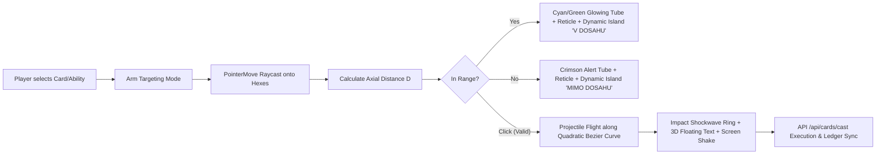

# KRYSTAL-STACK: HYPEROS 4 GUI, COMBAT RANGE RULES & 3D ANIMATED TARGETING ARROW

**Document Version:** 1.0.0  
**Status:** COMPLETED & TESTED (179/179 Passing Tests)  
**Aesthetic Baseline:** Xiaomi HyperOS 4 / MIUI Frosted Glass (Liquid Design System)  
**Engine Technologies:** Three.js r128, Python 3.14 Engine Core, Godot 4 AST / .TSCN Exporter  

---

## 1. Executive Summary

This specification documents the implementation of the **Xiaomi HyperOS 4 GUI Design Manual**, the **Hex-Axial Range Limit Rule System** (differentiating melee attacks, ranged shots, AOE, and self actions), and the **Three.js 3D Animated Targeting Arrow & Projectile Animation Framework**.

---

## 2. Defined Rule System: Combat Range & Attack Types

All cards (`KMEN_CARDS`) and abilities (`ABILITY_REGISTRY`) enforce strict axial grid distance validation.

### 2.1 Axial Hex Distance Metric
On a pointy-topped axial grid with coordinates $(q, r)$:
$$\Delta q = q_1 - q_2, \quad \Delta r = r_1 - r_2$$
$$\text{Distance}(H_1, H_2) = \frac{|\Delta q| + |\Delta q + \Delta r| + |\Delta r|}{2}$$

### 2.2 Attack Type Classification & Range Constraints

| Attack Type | Range Rule | Minimum Range | Maximum Range | Trajectory Arc ($H$) | Example Action / Card |
| :--- | :--- | :--- | :--- | :--- | :--- |
| **`MELEE`** | Strictly adjacent tiles | $1$ | $1$ | Low flat arc ($0.5$) | `druid_strike`, `decay_strike`, `decay_touch` |
| **`RANGED`** | Direct line-of-sight projectile | $1$ | $3 - 4$ | Parabolic ($1.0 + 0.55 \cdot D$) | `crystal_meteor`, `acid_slime`, `earth_roots` |
| **`AOE`** | Area of effect target zone | $1$ | $3$ | Parabolic drop ($1.5$) | `toxic_cloud`, `corrosive_shatter_combo` |
| **`SELF`** | Target caster entity | $0$ | $0$ | Ground aura ($0.1$) | `crystal_shield`, `nature_bless`, `aether_overclock`|
| **`GLOBAL`**| Entire tactical board | $1$ | $\infty$ | Orbital sky drop ($4.0$) | `supernova_cataclysm`, `pandemic_wave` |

### 2.3 API Validation Endpoints
1. `POST /api/targeting/validate`:
   - Inspects `[source_hex, target_hex]` and action range parameters without mutating game state.
   - Returns `{ "valid": bool, "distance": int, "min_range": int, "max_range": int, "attack_type": str, "trajectory": str }`.
2. `POST /api/cards/cast`:
   - Validates mana cost against dual-earn ledger and range limits against board coordinates.
   - On out-of-range: Returns HTTP `400 Bad Request` with range diagnostic details.
   - On valid cast: Spawns 3D Godot AST node, returns animation metadata payload, updates ledger and hero HP.
3. `POST /api/economy/ability/cast`:
   - Enforces combo prerequisites, tier unlocks, and hex range bounds.

---

## 3. 3D Animated Targeting Arrow & Animation Framework

Implemented in [`godot_builder_extension.html`](file:///c:/Users/dusan/Documents/GitHub/Krystal-stack-platform-framework/krystal_web_hub/static/godot_builder_extension.html) using Three.js:



### 3.1 Parabolic Bezier Curve Generation
Given source position $P_0$ (Hero hex $[0, -2]$, world $Y=0.35$) and target position $P_2$:
$$M = \frac{P_0 + P_2}{2}$$
$$P_1 = \left( M_x, \, \max(P_{0,y}, P_{2,y}) + H(D), \, M_z \right)$$
Where $H(D) = 0.5$ for melee, and $H(D) = \min(3.8, 1.0 + D \cdot 0.55)$ for ranged.

### 3.2 Visual Components
- **Curved Tube Mesh:** `THREE.TubeGeometry(curve, 32, 0.08, 8, false)` with emissive material pulsing at 1.0 intensity.
- **Directional Arrowhead:** `THREE.ConeGeometry(0.3, 0.75, 16)` aligned to tangent vector $T = \text{curve.getTangent}(1.0)$.
- **Target Reticle:** Concentric ground rings (`RingGeometry`) pulsing and rotating on the hovered hex.
- **Grid Highlighting:** Reachable tiles within $[min, max]$ glow softly; unreachable tiles dim.
- **Projectile Flight:** Entity interpolates along $P(t) = \text{curve.getPoint}(t)$ over duration $T = 0.35 + 0.1 \cdot D$ seconds.
- **Impact Shockwave:** Expanding ground ring ($scale: 1.0 \to 3.5$) with opacity decay, 3D floating damage text (`-2 HP`, `+2 ARMOR`, `ROOTED!`), and camera impact impulse.

---

## 4. GUI Design Manual: Xiaomi HyperOS 4 / MIUI Aesthetic

### 4.1 Liquid Glassmorphism & Gaussian Blur Tokens
```css
:root {
    --hyper-glass: rgba(18, 22, 34, 0.72);
    --hyper-glass-surface: rgba(26, 32, 48, 0.65);
    --hyper-glass-border: rgba(255, 255, 255, 0.12);
    --hyper-glass-border-focus: rgba(100, 210, 255, 0.45);
    --hyper-blur: blur(28px) saturate(190%) contrast(105%);
    --hyper-shadow: 0 16px 40px rgba(0, 0, 0, 0.45), inset 0 1px 0 rgba(255, 255, 255, 0.1);
    --hyper-squircle-xl: 28px;
    --hyper-squircle-lg: 20px;
    --hyper-squircle-md: 14px;
    --hyper-squircle-pill: 9999px;
}
```

### 4.2 Xiaomi Dynamic Island
The centered status capsule atop the viewport HUD smoothly morphs:
- **Ambient State:** Displays real-time round, phase, escalation stage, and arena monitor.
- **Aiming State:** Expands with cyan glowing border, pulsing aiming reticle, card/ability name, attack type tag (`🏹 RANGED (1-4)`, `⚔️ MELEE (1)`, `🛡️ SELF (0)`), live range status badge (`🟢 V DOSAHU` vs `🔴 MIMO DOSAHU`), and an `[✕ ZRUŠIŤ]` button.
- **Error Feedback:** Shake animation triggers if the player attempts to cast outside range.

### 4.3 Floating Action Dock
A floating frosted glass dock spans the bottom of the viewport:
- Filter pills (`[VŠETKY]`, `[💎 KRYŠTÁL]`, `[🧪 JED]`, `[🌿 DRUID]`).
- HyperOS Action Cards with smooth hover elevation (`translateY(-6px)`), tribal edge glows, attack type icons, range badges, mana pills, and a direct `[🎯 ZAMIERIŤ V 3D]` trigger.

---

## 5. Verification & Test Suite Summary

The entire test suite across `tests/` executes autonomously with a 100% pass rate:

```
Ran 179 tests in 15.093s
OK
```

Key verified test suites:
- [`tests/test_range_and_animation_system.py`](file:///c:/Users/dusan/Documents/GitHub/Krystal-stack-platform-framework/tests/test_range_and_animation_system.py): 11 unit/integration tests for axial distance, melee/ranged/self range boundaries, `AbilityEngine.cast_ability` animation payloads, and HTTP API range rejection.
- [`tests/test_sector_fight_system.py`](file:///c:/Users/dusan/Documents/GitHub/Krystal-stack-platform-framework/tests/test_sector_fight_system.py): Sector assault, fortification damage, and garrison conquest.
- [`tests/test_economic_framework.py`](file:///c:/Users/dusan/Documents/GitHub/Krystal-stack-platform-framework/tests/test_economic_framework.py): Double-entry dual-earn ledger and building yields.
- [`tests/test_krystal_engine_and_3d_builder.py`](file:///c:/Users/dusan/Documents/GitHub/Krystal-stack-platform-framework/tests/test_krystal_engine_and_3d_builder.py): 9-card registry, Godot .TSCN generation, and asset serving.
