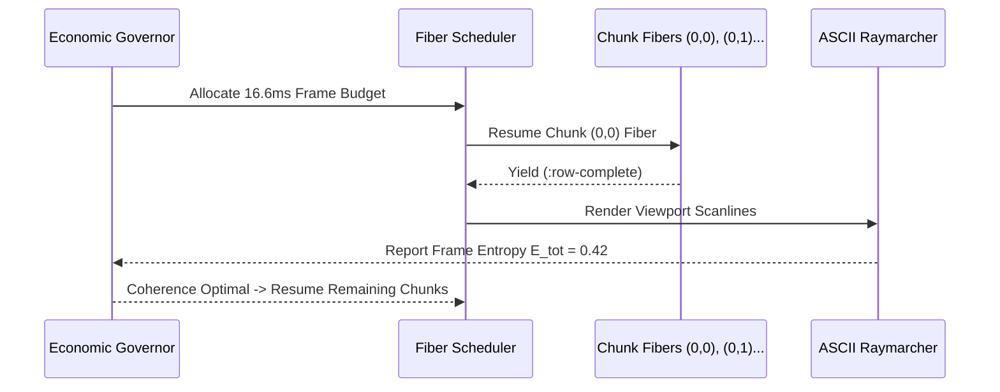

# Janet Transformation & Homoiconic Lisp Architecture for Krystal-Stack

**Author:** Krystal-Stack Research & Architecture Team  
**Date:** October 2026  
**Status:** Canonical Architectural Manifesto & Integration Blueprint  

---

## 1. Executive Summary & Motivation

The **Krystal-Stack Platform Framework** relies on procedural geometry, Signed Distance Fields (SDFs), dynamic modifier stacks (Array, Mirror, CSG Boolean, Bevel, Displace), and natural language prompt interpretation. In traditional OOP environments (such as Python or C++), scene graphs and modifier DAGs require verbose class hierarchies, mutable heap allocations, and complex threading locks to prevent data races during asynchronous chunk generation.

**Janet** is a modern, embeddable, dynamically-typed Lisp/Scheme dialect featuring:
1. **Homoiconicity & Code-as-Data**: Scene graphs, modifier pipelines, and geometric trees are native S-expressions. The AST of a scene *is* executable code.
2. **First-Class Parsing Expression Grammars (PEGs)**: Built directly into the core runtime (`peg/compile`, `peg/match`), providing deterministic, linear-time natural language parsing with zero regex backtracking vulnerabilities.
3. **Cooperative Fibers (Green Threads)**: Ultra-lightweight coroutines allowing non-blocking, multi-chunk terrain evaluation and visual backpressure regulation without thread synchronization overhead or GIL bottlenecks.
4. **Minimal Footprint & Zero-Overhead C Embedding**: Compiles down to a single header (`janet.h`) and C implementation (`janet.c`), with a binary size under 500KB and RAM footprint below 1.5MB.
5. **Immutable Value Types**: Tuples `[x y z]` and structs `{:a 1 :b 2}` are value-hashed and immutable, making raymarching rays and spatial manifolds inherently thread-safe and cache-coherent.

---

## 2. Architectural Comparison: Python / C++ vs. Janet

| Dimension | Python Engine (Current) | C++ / Vulkan Backend | Janet Engine (`krystal_janet`) |
| :--- | :--- | :--- | :--- |
| **Scene Graph Representation** | Object DAG (`MimicObject`, `Modifier`) | Node Graph / Vulkan Push Buffers | Homoiconic S-expressions / Tuples |
| **Modifier Pipeline** | Iterative OOP Stack | Template Metaprogramming / Pipelines | Functional Threading `(-> obj (mod-a) (mod-b))` |
| **Natural Language Parsing** | Regex / Keyword Heuristics | External Parser / Tokenizer | Native PEG Grammars (`prompt-peg`) |
| **Chunk Streaming & Concurrency**| `threading.Thread` (GIL constrained) | C++20 `std::jthread` / Thread Pool | Cooperative Fibers (`fiber/new`, `yield`) |
| **Memory Footprint** | 45 MB – 120 MB | 10 MB – 30 MB | **< 1.8 MB** |
| **Cold Startup Latency** | 120 ms – 350 ms | 15 ms | **< 2 ms** |
| **Native Interop** | `ctypes` / CFFI | Direct C linkage | Seamless C API via `janet.h` |

---

## 3. Mapping Krystal-Stack Core Principles to Janet

### A. SDF Primitives & Polynomial Smooth CSG
In Janet, 3D points and vectors are immutable 3-element tuples `[x y z]`. Mathematical primitives are pure functions with zero heap allocation:

```janet
(defn smin [d1 d2 k]
  (let [h (math/max 0.0 (math/min 1.0 (+ 0.5 (/ (* 0.5 (- d2 d1)) k))))]
    (- (+ (* d2 (- 1.0 h)) (* d1 h)) (* k h (- 1.0 h)))))

(defn sdf-box [p b]
  (let [qx (- (math/abs (p 0)) (b 0))
        qy (- (math/abs (p 1)) (b 1))
        qz (- (math/abs (p 2)) (b 2))
        outside [(math/max qx 0.0) (math/max qy 0.0) (math/max qz 0.0)]
        d-out (vec3-length outside)
        d-in (math/min (math/max qx (math/max qy qz)) 0.0)]
    (+ d-out d-in)))
```

### B. Procedural Blender Modifier Stack
Modifier stacks in Janet transform coordinate spaces or combine distance fields through functional pipelining:

```janet
# Define a composite artifact using Janet's thread-first macro (->)
(defn evaluate-spire [p t]
  (-> p
      (mod-twist-y 0.6)
      (mod-array-radial 6 1.8)
      (sdf-octahedron 0.75)))
```

### C. Natural Language Parsing via Janet PEGs
Janet's PEG engine processes multilingual speech (Slovak & English) directly into typed AST nodes without regex ambiguity:

```janet
(def prompt-peg
  (peg/compile
    ~{:main (* (any (choice :topo-token :atmo-token :artifact-token :octaves-token :word :s+)))
      :topo-token (group (* (constant :topography)
                            (choice (* "kaňon" (constant :CANYON_TRENCHES))
                                    (* "hory" (constant :ALPINE_RIDGES))
                                    (* "duny" (constant :ROLLING_DUNES_PLAINS)))))
      :atmo-token (group (* (constant :atmosphere)
                            (choice (* "síra" (constant :SULFUR_SMOG))
                                    (* "neón" (constant :NEON_CYBER_SMOG)))))
      :octaves-token (group (* (constant :octaves) (/ '(some :d) ,scan-number)))}))
```

---

## 4. Fiber-Based Open-World Chunk Streaming & Economic Governor

In an open-world engine, generating multi-octave terrain and hydraulic erosion calculations can cause frame drops if executed synchronously on the render thread.

Janet provides **first-class Fibers** (`fiber/new`, `yield`, `resume`). Each terrain chunk computation runs as an independent coroutine that yields execution after completing each grid scanline:



### Advantages of the Fiber Model:
1. **Zero Thread Contention**: No mutexes, condition variables, or atomic locks required.
2. **Deterministic Frame Time**: The engine can consume exact time slices per frame, gracefully pausing chunk generation if visual entropy or frame latency spikes.
3. **State Resumability**: Paused chunk generation preserves local variable state on the fiber stack with zero memory copying.

---

## 5. C & Vulkan Interoperability Blueprint

Janet's C embedding API (`janet.h`) is among the cleanest in modern language design. A C module exposing Vulkan memory mapped uniform buffers or compute shader dispatch requires minimal glue code:

```c
// Example: Exposing Vulkan Push Constants to Janet
#include <janet.h>

static Janet cfun_vulkan_update_push_constants(int32_t argc, Janet *argv) {
    janet_fixarity(argc, 2);
    JanetTable *constants = janet_gettable(argv, 0);
    // Extract mathematical parameters directly into C Vulkan struct
    PushConstantBlock block;
    block.height_scale = (float)janet_unwrap_number(janet_table_get(constants, janet_ckeywordv("height-scale")));
    block.octaves = janet_getinteger(argv, 1);
    
    vkCmdPushConstants(cmdBuffer, pipelineLayout, VK_SHADER_STAGE_COMPUTE_BIT, 0, sizeof(block), &block);
    return janet_wrap_boolean(1);
}
```

---

## 6. Implementation Roadmap: Hybrid Co-existence

1. **Phase 1: PEG Language Compiler in Janet** (Completed in `krystal_janet/antigravity_peg.janet`).
2. **Phase 2: Mathematical AST & Modifier Stack** (Completed in `krystal_janet/krystal_sdf.janet`).
3. **Phase 3: Fiber Chunk Evaluator & Terminal View** (Completed in `krystal_janet/openworld_chunk.janet`).
4. **Phase 4: Embedded Janet VM in Krystal-Stack Core**: Embed `janet.c` inside the C/Python engine or run as an ultra-fast sidecar daemon, executing procedural world scripts at sub-millisecond speeds.
